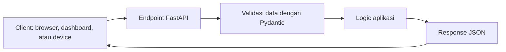

# API dengan FastAPI

Halaman ini membahas cara backend menerima dan membalas request.

Bayangkan backend sebagai meja penerima pesan. Frontend, device, atau script simulator mengirim pesan ke alamat tertentu. Alamat itu disebut **endpoint**.

## Tujuan

Setelah membaca halaman ini, kamu diharapkan bisa:

- memahami fungsi endpoint,
- membedakan `GET` dan `POST`,
- membaca bentuk request dan response JSON,
- memahami kenapa Pydantic dipakai di FastAPI.

## Alur API Sederhana



## Endpoint

Endpoint adalah alamat yang bisa dipanggil dari luar aplikasi.

Contoh:

```text
GET /health
POST /sensors
```

`GET /health` biasanya dipakai untuk mengecek apakah server hidup.

`POST /sensors` biasanya dipakai untuk mengirim data baru, misalnya pembacaan sensor.

## Request dan Response

**Request** adalah pesan masuk ke backend.

Contoh request JSON:

```json
{
  "device_id": "device-01",
  "sensor_type": "temperature",
  "value": 28.5
}
```

**Response** adalah balasan dari backend.

Contoh response JSON:

```json
{
  "message": "Data diterima",
  "status": "ok"
}
```

## Kenapa Perlu Pydantic?

Pydantic membantu backend mengecek bentuk data.

Kalau backend mengharapkan `value` berupa angka, tetapi client mengirim teks, Pydantic akan menolak request tersebut sebelum masuk ke logic utama.

Ini membuat aplikasi lebih aman dan lebih mudah di-debug.

```python
from pydantic import BaseModel


class SensorIn(BaseModel):
    device_id: str
    sensor_type: str
    value: float
```

Model di atas berarti:

- `device_id` harus teks,
- `sensor_type` harus teks,
- `value` harus angka.

## Status Code

Status code adalah kode singkat dari backend untuk memberi tahu hasil request.

| Status | Arti sederhana | Biasanya terjadi saat |
| --- | --- | --- |
| `200` | Berhasil | Data berhasil dibaca |
| `201` | Berhasil dibuat | Data baru berhasil disimpan |
| `400` | Request salah | Data tidak masuk akal |
| `404` | Tidak ditemukan | Endpoint atau data tidak ada |
| `422` | Format data tidak cocok | JSON tidak sesuai model Pydantic |
| `500` | Error server | Ada bug atau service gagal |

## Error yang Sering Muncul

`422 Unprocessable Entity` biasanya berarti bentuk JSON tidak sesuai dengan model Pydantic.

`404 Not Found` biasanya berarti alamat endpoint salah.

`500 Internal Server Error` biasanya berarti ada error di kode backend.

## Quick Check

Saat membuat endpoint baru, tanyakan:

- endpoint ini menerima data atau hanya membaca data?
- data masuknya berbentuk apa?
- response suksesnya seperti apa?
- error apa yang mungkin terjadi?

## Menemukan Pola

Setelah memahami halaman ini, buka proyek AIoT nyata dan cari folder route atau controller.

Di Smart Hydroponic, pola ini bisa ditemukan pada:

```text
backend/main.py
backend/routes/
backend/schemas/
```

Cari satu endpoint, lalu baca dari atas ke bawah: alamatnya apa, input-nya apa, dan response-nya apa.

[Kembali ke Overview Backend](overview.md)
