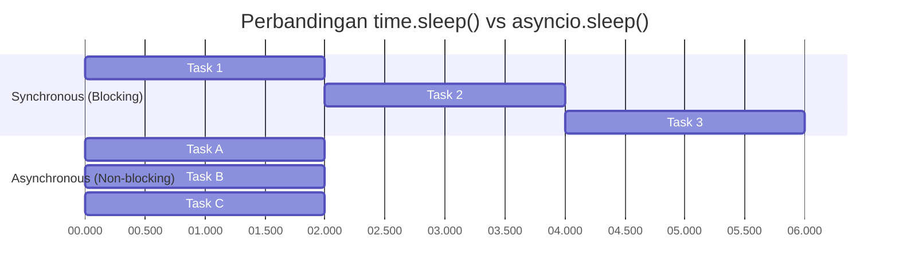
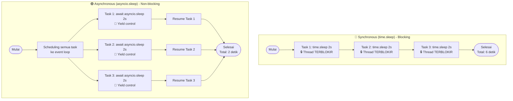

# Backend Fundamental

Sebelum memasuki pengenalan FastAPI, halaman ini akan membahas dasar-dasar pemrograman Python yang relevan untuk pengembangan backend, termasuk konsep typing dan async yang akan sering digunakan dalam implementasi API.

## Pengenalan Python untuk Backend

Python adalah bahasa pemrograman yang populer untuk pengembangan backend karena sintaksnya yang sederhana dan dukungan _library_ yang luas. Dalam konteks pengembangan API dengan FastAPI, beberapa konsep Python yang penting untuk dipahami meliputi:

- **Typing**: Python mendukung _type hints_ yang membantu dalam penulisan kode yang lebih jelas dan mudah dipahami. FastAPI memanfaatkan fitur ini untuk validasi data secara otomatis.
- **Async**: FastAPI dirancang untuk mendukung pemrograman asinkron,
yang memungkinkan penanganan banyak permintaan secara efisien tanpa memblokir eksekusi.
- **Error Handling**: Memahami cara menangani error dengan benar sangat penting untuk memberikan respons yang tepat kepada klien dan menjaga stabilitas aplikasi.
- **Virtual Environment**: Penggunaan virtual environment membantu dalam mengelola dependensi proyek dan menjaga lingkungan pengembangan tetap bersih.

## Instalasi dan Setup

Pastikan Python 3.14 atau terbaru sudah terpasang di sistem kamu. Instalasi [Python](https://www.python.org/downloads/) dapat dilakukan melalui situs resmi atau menggunakan package manager seperti `apt` untuk Linux atau `brew` untuk macOS.

!!! info "Python 3.14+"

    Instalasi Python 3.14 atau versi terbaru sudah diganti dengan `Python install manager` atau `pymanager` yang lebih modern dan fleksibel untuk mengatur beberapa versi Python dalam satu sistem. Untuk instalasi, kamu bisa ikuti langkah yang ditampilkan pada terminal setelah memasang `pymanager`.

## Python Dasar

---

### Print, Variabel, dan Tipe Data

- **Print**: Fungsi `print()` digunakan untuk menampilkan output ke konsol.

    ```python
    print("Hello, World!")
    ```

    That's it! Tanpa titik koma, namun kamu bisa menggunakan titik koma untuk menulis beberapa pernyataan dalam satu baris. Tapi Python sendiri bergantung kepada indentasi untuk menentukan blok kode.

- **Variabel**: Variabel digunakan untuk menyimpan data. Python adalah bahasa yang dinamis, jadi kamu tidak perlu mendeklarasikan tipe data saat membuat variabel.

    ```mermaid
    architecture-beta
        service value(ic:baseline-123)[Data]
        service variable(boxicons:package)[Variabel]

        value:R --> L:variable
    ```

    ```python
    name = "Alice"
    age = 30
    is_student = False
    print(name, age, is_student) # Output: ALice 30 False
    ```

- **Tipe Data**: Python memiliki beberapa tipe data dasar seperti `str` (string), `int` (integer), `float` (floating-point), `bool` (boolean), dan `list` (daftar).

    ```python
    name = "Alice"  # str
    age = 30        # int
    height = 1.75   # float
    is_student = False  # bool
    hobbies = ["reading", "coding", "hiking"]  # list
    print(name, age, height, is_student, hobbies)
    ```

    !!! info "Tipe Data Lainnya"

        Selain tipe data dasar, Python juga memiliki tipe data lainnya seperti `tuple`, `set`, dan `dict` yang sering digunakan dalam pengembangan backend.

    !!! info "Tipe Data adalah Objek"

        Di Python, semua tipe data adalah objek, yang berarti mereka memiliki atribut dan metode yang dapat digunakan untuk memanipulasi data.

    !!! tips "Cek Tipe Data"

        Kamu bisa menggunakan fungsi `type()` untuk memeriksa tipe data dari sebuah variabel.

        ```python
        print(type(name))  # Output: <class 'str'>
        print(type(age))   # Output: <class 'int'>
        ```

### Fungsi dan Kontrol Alur

- **Fungsi**: Fungsi adalah blok kode yang dapat digunakan kembali untuk melakukan tugas tertentu. Kamu dapat mendefinisikan fungsi menggunakan kata kunci `def`.

    ```python
    def greet(name):
        return f"Hello, {name}!"

    print(greet("Alice"))  # Output: Hello, Alice!
    ```

- **parameter dan Argumen**: Fungsi dapat menerima parameter yang digunakan untuk memberikan input ke dalam fungsi. Saat memanggil fungsi, kamu memberikan argumen yang sesuai dengan parameter yang telah didefinisikan.

    ```python
    def add(a, b):
        return a + b

    result = add(5, 3)
    print(result)  # Output: 8
    ```

    !!! info "Parameter Default"

        Kamu juga dapat memberikan nilai default untuk parameter, sehingga jika argumen tidak diberikan saat memanggil fungsi, nilai default akan digunakan.

        ```python
        def greet(name="Guest"):
            return f"Hello, {name}!"

        print(greet())  # Output: Hello, Guest!
        print(greet("Alice"))  # Output: Hello, Alice!
        ```

- **Prosedur**: Prosedur adalah fungsi yang tidak mengembalikan nilai. Mereka digunakan untuk melakukan tindakan tertentu tanpa memberikan hasil kembali.

    ```python
    def print_greeting(name):
        print(f"Hello, {name}!")

    print_greeting("Bob")  # Output: Hello, Bob!
    ```

- **Kontrol Alur**: Python memiliki beberapa struktur kontrol alur seperti `if`, `for`, dan `while` untuk mengontrol eksekusi kode.

    ```python
    # If statement
    age = 30
    if age >= 18:
        print("You are an adult.")
    else:
        print("You are a minor.")

    # For loop
    hobbies = ["reading", "coding", "hiking"]
    for hobby in hobbies:
        print(hobby)
    # While loop
    count = 0
    while count < 5:
        print(count)
        count += 1
    ```

### Collections

- **List**: List adalah koleksi yang dapat diubah (mutable) dan diurutkan. Kamu dapat menyimpan berbagai tipe data dalam satu list.

    ```python
    my_list = [1, "hello", 3.14, True]
    print(my_list)  # Output: [1, 'hello', 3.14, True]
    ```

- **Tuple**: Tuple adalah koleksi yang tidak dapat diubah (immutable) dan diurutkan. Mereka digunakan untuk menyimpan data yang tidak boleh diubah setelah dibuat.

    ```python
    my_tuple = (1, "hello", 3.14, True)
    print(my_tuple)  # Output: (1, 'hello', 3.14, True)
    ```

- **Set**: Set adalah koleksi yang tidak diurutkan dan tidak mengizinkan duplikasi. Mereka digunakan untuk menyimpan elemen unik.

    ```python
    my_set = {1, "hello", 3.14, True}
    print(my_set)  # Output: {1, 'hello', 3.14, True}
    ```

- **Dictionary**: Dictionary adalah koleksi yang tidak diurutkan dan dapat diubah, yang menyimpan pasangan kunci-nilai.

    ```python
    my_dict = {"name": "Alice", "age": 30, "is_student": False}
    print(my_dict)  # Output: {'name': 'Alice', 'age': 30, 'is_student': False}
    ```

### Collections Comprehension

- **List Comprehension**: List comprehension adalah cara yang lebih singkat dan efisien untuk membuat list baru berdasarkan iterasi atas koleksi yang ada.

    ```python
    squares = [x**2 for x in range(10)]
    print(squares)  # Output: [0, 1, 4, 9, 16, 25, 36, 49, 64, 81]
    ```

- **Dictionary Comprehension**: Dictionary comprehension memungkinkan kamu untuk membuat dictionary baru dengan cara yang lebih singkat.

    ```python
    squared_dict = {x: x**2 for x in range(10)}
    print(squared_dict)  # Output: {0: 0, 1: 1, 2: 4, 3: 9, 4: 16, 5: 25, 6: 36, 7: 49, 8: 64, 9: 81}
    ```

- **Set Comprehension**: Set comprehension memungkinkan kamu untuk membuat set baru dengan cara yang lebih singkat.

    ```python
    squared_set = {x**2 for x in range(10)}
    print(squared_set)  # Output: {0, 1, 4, 9, 16, 25, 36, 49, 64, 81}
    ```

- **Tuple Comprehension**: Python tidak memiliki sintaks khusus untuk tuple comprehension, tetapi kamu bisa menggunakan generator expression untuk membuat tuple.

    ```python
    squared_tuple = tuple(x**2 for x in range(10))
    print(squared_tuple)  # Output: (0, 1, 4, 9, 16, 25, 36, 49, 64, 81)
    ```

### Error Handling

- **Try-Except**: Blok `try-except` digunakan untuk menangani error yang mungkin terjadi selama eksekusi kode. Kamu dapat menangkap jenis error tertentu dan memberikan respons yang sesuai.

    ```python
    try:
        result = 10 / 0
    except ZeroDivisionError:
        print("Cannot divide by zero!")
    ```

    !!! info "Multiple Except"

        Kamu juga dapat menangkap beberapa jenis error dalam satu blok `try` dengan menggunakan beberapa blok `except`.

        ```python
        try:
            result = 10 / 0
        except ZeroDivisionError:
            print("Cannot divide by zero!")
        except Exception as e:
            print(f"An error occurred: {e}")
        ```

- **Finally**: Blok `finally` digunakan untuk mengeksekusi kode yang harus dijalankan terlepas dari apakah error terjadi atau tidak.

    ```python
    try:
        result = 10 / 0
    except ZeroDivisionError:
        print("Cannot divide by zero!")
    finally:
        print("This will always be executed.")
    ```

- **Raise**: Kamu dapat menggunakan kata kunci `raise` untuk memicu error secara manual dalam kode kamu.

    ```python
    def divide(a, b):
        if b == 0:
            raise ValueError("Cannot divide by zero!")
        return a / b

    try:
        result = divide(10, 0)
    except ValueError as e:
        print(e)  # Output: Cannot divide by zero!
    ```

- **Custom Exceptions**: Kamu juga dapat membuat kelas exception kustom untuk menangani error yang spesifik dalam aplikasi kamu.

    ```python
    class CustomError(Exception):
        pass

    def risky_function():
        raise CustomError("Something went wrong!")

    try:
        risky_function()
    except CustomError as e:
        print(e)  # Output: Something went wrong!
    ```

### Async dan Await

Async dan Await digunakan untuk mendefinisikan fungsi asinkron yang dapat dijalankan secara non-blocking. Kedua keyword ini harus digunakan bersama-sama untuk memastikan bahwa fungsi asinkron dapat menunggu hasil dari operasi yang memakan waktu tanpa memblokir eksekusi kode lainnya. Untuk melakukan operasi asinkron, kamu perlu menggunakan `asyncio` library yang merupakan bagian dari Python standar library.

```python
import asyncio

async def async_function():
    print("Start")
    await asyncio.sleep(1)
    print("End")

asyncio.run(async_function())
```

Apa yang terjadi pada contoh kode di atas? Fungsi `async_function` akan mencetak "Start", kemudian menunggu selama 1 detik tanpa memblokir eksekusi, dan akhirnya mencetak "End". Ini memungkinkan aplikasi untuk tetap responsif dan menangani permintaan lain selama operasi yang memakan waktu sedang berlangsung. Mungkin terlihat seperti menggunakan `time.sleep()`, tetapi `asyncio.sleep()` tidak memblokir eksekusi, sehingga aplikasi tetap dapat menangani proses lain selama menunggu.

Agar terlihat lebih jelas, berikut contoh kode yang lebih kompleks dan membandingkan dengan penggunaan `time.sleep()`:

??? example "Perbedaan antara Blocking dan Non-blocking"

    ```python
    import time
    import asyncio

    # Synchronous version (Blocking)
    def task_sync(task_id, duration):
        print(f"Task {task_id} mulai...")
        time.sleep(duration)  # memblokir eksekusi lainnya
        print(f"Task {task_id} selesai!")
        return f"Hasil task {task_id}"

    def run_sync_tasks():
        print("\n=== SYNCHRONOUS: Tasks berjalan BERURUTAN ===")
        start = time.time()
        
        # Tasks berjalan satu per satu (total waktu = jumlah semua duration)
        result1 = task_sync(1, 2)
        result2 = task_sync(2, 2)
        result3 = task_sync(3, 2)
        
        end = time.time()
        print(f"Total waktu sync: {end - start:.2f} detik")
        # Output: Total waktu sync: ~6 detik

    # Asynchronous version (Non-blocking)
    async def task_async(task_id, duration):
        print(f"Task {task_id} mulai...")
        await asyncio.sleep(duration)  # TIDAK memblokir, memberi kesempatan task lain jalan
        print(f"Task {task_id} selesai!")
        return f"Hasil task {task_id}"

    async def run_async_tasks():
        print("\n=== ASYNCHRONOUS: Tasks berjalan BERSAMAAN ===")
        start = time.time()
        
        # Ketiga task berjalan "bersamaan"
        results = await asyncio.gather(
            task_async(1, 2),
            task_async(2, 2),
            task_async(3, 2)
        )
        
        end = time.time()
        print(f"Total waktu async: {end - start:.2f} detik")
        print(f"Hasil: {results}")
        # Output: Total waktu async: ~2 detik (bukan 6 detik!)

    # Jalankan
    run_sync_tasks()
    asyncio.run(run_async_tasks())
    ```

Pada contoh di atas, fungsi `process_with_sleep()` akan memblokir eksekusi selama 2 detik, sehingga aplikasi tidak dapat melakukan hal lain selama waktu tersebut. Sementara itu, fungsi `process_with_async()` menggunakan `asyncio.sleep()`, yang memungkinkan aplikasi untuk tetap responsif dan menangani proses lain selama menunggu, sehingga tidak memblokir eksekusi. Coba kamu tukar posisi kedua fungsi tersebut untuk melihat perbedaannya secara langsung!

Berikut chart yang menggambarkan perbedaan antara blocking dan non-blocking:



Flowchart


[Kembali ke Overview Backend](overview.md)