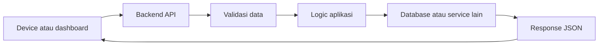

# Backend Development

Halaman backend berisi jalur belajar terkait pengembangan layanan API untuk sistem AIoT, mulai dari fundamental hingga integrasi lanjutan.

Backend adalah bagian yang menerima data, memproses aturan aplikasi, lalu mengirim response. Dalam AIoT, backend sering menjadi penghubung antara device, database, dashboard, dan layanan AI.

## Alur Besar

## Prasyarat

- Python 3.14+ terpasang
- Dasar terminal dan virtual environment
- Paham konsep JSON dasar

## Urutan Belajar yang Disarankan

1. [Python Fundamental](fundamental.md)
2. [OOP Python untuk Backend](oop-python.md)
3. [API dengan FastAPI](api-fastapi.md)
4. [Struktur Proyek Backend](project-structure.md)
5. [Backend Mini](../hands-on/backend-mini.md)

## Capaian Belajar

- Menjalankan server FastAPI secara lokal.
- Membuat endpoint `GET` dan `POST`.
- Melakukan validasi input sederhana dengan Pydantic.
- Membaca struktur folder backend tanpa panik.
- Menangani error dasar dan status code HTTP.

## Pembagian Section

| Section | Fokus |
| --- | --- |
| Python Fundamental | bahasa Python yang sering muncul di backend |
| OOP Python | class, object, method, dan pola class di backend |
| API dengan FastAPI | endpoint, request, response, validasi |
| Struktur Proyek Backend | cara membaca folder backend yang lebih besar |
| Backend Mini | quick win membuat API kecil |

## Tips Membaca

Jangan mulai dari semua file sekaligus.

Mulai dari satu endpoint sederhana, lalu ikuti alurnya: route, schema, service, database.

[Kembali ke Home](../index.md)
