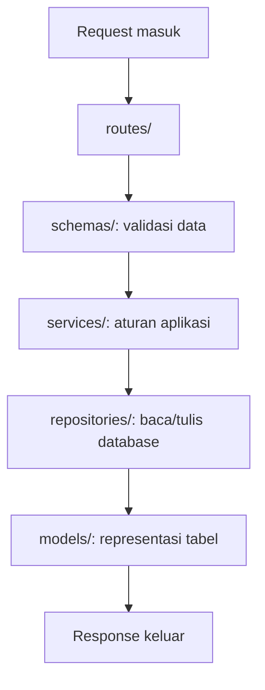

# Struktur Proyek Backend

Saat aplikasi masih kecil, semua kode bisa ditulis di satu file.

Namun ketika fitur bertambah, satu file akan cepat penuh. Karena itu backend biasanya dibagi menjadi beberapa folder.

Tujuannya bukan terlihat keren. Tujuannya supaya kita tahu harus mencari kode di mana.

## Peta Folder Umum

```text
backend/
├── main.py
├── routes/
├── schemas/
├── models/
├── services/
├── repositories/
├── migrations/
└── tests/
```

!!! Note
    Struktur ini bukan aturan baku. Setiap proyek bisa punya struktur yang berbeda. Yang penting kita tahu fungsi tiap bagian.

## Fungsi Tiap Bagian

| Bagian | Fungsi sederhana |
| --- | --- |
| `main.py` | pintu masuk aplikasi |
| `routes/` | daftar endpoint API |
| `schemas/` | bentuk data request dan response |
| `models/` | bentuk data yang disimpan di database |
| `services/` | logic utama aplikasi |
| `repositories/` | kode yang berhubungan dengan database |
| `migrations/` | riwayat perubahan struktur database |
| `tests/` | kode untuk mengecek aplikasi tetap benar |

## Alur Saat Request Masuk



## Kenapa Tidak Langsung Semua di Route?

Bisa saja untuk latihan kecil.

Tetapi kalau semua logic ditaruh di route, file endpoint akan sulit dibaca. Route sebaiknya menjawab pertanyaan:

> "Endpoint ini menerima apa dan memanggil proses apa?"

Detail prosesnya lebih enak diletakkan di service.

## Cara Membaca Backend Besar

Jangan mulai dari semua file.

Mulai dari satu endpoint.

1. Cari alamat endpoint di `routes/`.
2. Lihat schema input dan output di `schemas/`.
3. Ikuti fungsi yang dipanggil ke `services/`.
4. Kalau ada database, ikuti ke `repositories/` atau `models/`.
5. Catat hal yang belum paham, jangan langsung dibongkar semua.

## Menemukan Pola

Ambil endpoint sederhana di proyek nyata.

Tulis catatan singkat:

```text
Endpoint:
File route:
Schema yang dipakai:
Service yang dipanggil:
Database yang disentuh:
Hal yang membuatku penasaran:
```

Ini latihan membaca kode, bukan ujian hafalan.

[Kembali ke Overview Backend](overview.md)
