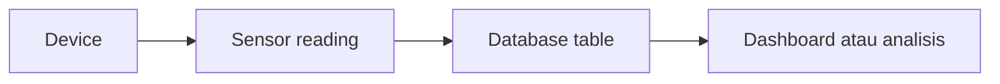

# Desain Data IoT

Data IoT biasanya datang berkali-kali dari perangkat.

Satu device bisa mengirim data setiap beberapa detik. Kalau device banyak, data cepat membesar.

Karena itu desain tabel perlu dipikirkan sejak awal.

## Pola Data Sensor



Data sensor biasanya punya:

- identitas device,
- jenis sensor,
- nilai sensor,
- satuan,
- waktu pencatatan.

## Contoh Tabel

```sql
CREATE TABLE sensor_readings (
  id BIGSERIAL PRIMARY KEY,
  device_id TEXT NOT NULL,
  sensor_type TEXT NOT NULL,
  value DOUBLE PRECISION NOT NULL,
  unit TEXT,
  recorded_at TIMESTAMPTZ NOT NULL DEFAULT now()
);
```

## Kenapa Waktu Penting?

Dalam AIoT, waktu adalah bagian penting dari data.

Tanpa waktu, kita hanya tahu nilai sensor. Dengan waktu, kita bisa melihat pola:

- nilai naik atau turun,
- device berhenti mengirim data,
- ada anomali pada jam tertentu,
- data berubah setelah aktuator dinyalakan.

## Indeks Dasar

Indeks membantu database mencari data lebih cepat.

Untuk data sensor, indeks yang sering berguna:

```sql
CREATE INDEX idx_sensor_readings_device_time
ON sensor_readings (device_id, recorded_at DESC);
```

Indeks ini membantu query seperti:

```sql
SELECT *
FROM sensor_readings
WHERE device_id = 'device-01'
ORDER BY recorded_at DESC
LIMIT 10;
```

## Menemukan Pola

Buka model database di proyek nyata.

Cari:

- nama tabel,
- kolom waktu,
- kolom device,
- relasi antar tabel,
- migration yang membuat tabel tersebut.

Kalau belum paham semua kolom, tidak apa-apa. Mulai dari tiga hal: device, nilai, waktu.

[Kembali ke Overview Database](overview.md)
