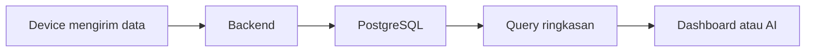

# Database Overview

Halaman database membahas dasar penyimpanan data sensor AIoT menggunakan PostgreSQL dan pengantar menuju skenario time-series dengan TimescaleDB.

Database adalah tempat aplikasi menyimpan catatan. Dalam AIoT, catatan itu biasanya berupa data device, data sensor, riwayat kontrol, dan hasil analisis.

## Alur Besar

## Urutan Belajar yang Disarankan

1. [SQL Basics](sql-basics.md)
2. [Desain Data IoT](data-modeling.md)
3. [Time-Series dan TimescaleDB](timeseries.md)
4. [Database Fundamental](fundamental.md)
5. [Database Mini](../hands-on/database-mini.md)

## Capaian Belajar

- Memahami tabel, baris, kolom, dan query SQL dasar.
- Mendesain tabel sederhana untuk data sensor.
- Membaca query `SELECT`, `INSERT`, dan `GROUP BY`.
- Memahami kenapa waktu penting dalam data IoT.
- Mengenali kapan TimescaleDB mulai dibutuhkan.

[Kembali ke Home](../index.md)
