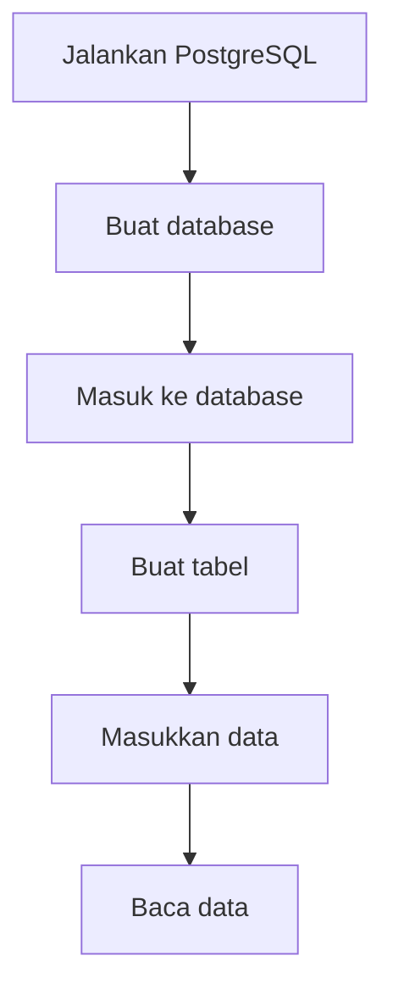

# SQL Basics

SQL adalah bahasa untuk berbicara dengan database relasional seperti PostgreSQL.

Kalau backend adalah penerima pesan, database adalah tempat menyimpan catatan.

Dokumentasi:

- [PostgreSQL Documentation](https://www.postgresql.org/docs/current/)
- [PostgreSQL CREATE DATABASE](https://www.postgresql.org/docs/current/sql-createdatabase.html)

## Bentuk Data Database

Database relasional menyimpan data dalam tabel.

```text
sensor_readings
```

| id | device_id | sensor_type | value | recorded_at |
| --- | --- | --- | --- | --- |
| 1 | device-01 | temperature | 28.5 | 2026-05-27 10:00 |

## Urutan dari Nol

Saat memakai PostgreSQL, urutan awalnya biasanya seperti ini:



## Membuat Database

Database adalah wadah besar untuk tabel.

Contoh membuat database:

```sql
CREATE DATABASE aiot_learning;
```

Setelah database dibuat, kamu perlu masuk ke database tersebut.

Jika memakai `psql`, perintahnya:

```bash
psql -d aiot_learning
```

Atau dari dalam `psql`:

```sql
\c aiot_learning
```

## Membuat Tabel

Tabel adalah tempat data disusun dalam baris dan kolom.

Contoh tabel untuk data sensor:

```sql
CREATE TABLE sensor_readings (
  id SERIAL PRIMARY KEY,
  device_id TEXT NOT NULL,
  sensor_type TEXT NOT NULL,
  value DOUBLE PRECISION NOT NULL,
  unit TEXT,
  recorded_at TIMESTAMPTZ NOT NULL DEFAULT now()
);
```

Arti sederhananya:

| Kolom | Fungsi |
| --- | --- |
| `id` | nomor unik setiap baris |
| `device_id` | identitas device |
| `sensor_type` | jenis sensor |
| `value` | nilai sensor |
| `unit` | satuan nilai |
| `recorded_at` | waktu data dicatat |

## Melihat Tabel

Di `psql`, kamu bisa melihat daftar tabel dengan:

```sql
\dt
```

Untuk melihat struktur tabel:

```sql
\d sensor_readings
```

## CRUD

CRUD adalah empat operasi dasar database.

| Operasi | SQL | Fungsi |
| --- | --- | --- |
| Create | `INSERT` | menambah data |
| Read | `SELECT` | membaca data |
| Update | `UPDATE` | mengubah data |
| Delete | `DELETE` | menghapus data |

## Contoh Query

Menambah data:

```sql
INSERT INTO sensor_readings (device_id, sensor_type, value, unit)
VALUES ('device-01', 'temperature', 28.5, 'celsius');
```

Membaca semua data:

```sql
SELECT * FROM sensor_readings;
```

Mengambil data terbaru:

```sql
SELECT *
FROM sensor_readings
ORDER BY recorded_at DESC
LIMIT 10;
```

Mengubah data:

```sql
UPDATE sensor_readings
SET value = 29.0
WHERE id = 1;
```

Menghapus data:

```sql
DELETE FROM sensor_readings
WHERE id = 1;
```

Untuk latihan awal, hati-hati saat memakai `UPDATE` dan `DELETE`. Selalu gunakan `WHERE` agar tidak mengubah atau menghapus semua data.

## Query Ringkasan

Dashboard sering butuh ringkasan, bukan hanya data mentah.

Contoh rata-rata nilai per device:

```sql
SELECT device_id, AVG(value) AS average_value
FROM sensor_readings
GROUP BY device_id;
```

## Menemukan Pola

Cari tabel atau model database di proyek AIoT nyata.

Pertanyaan kecil:

- data apa yang disimpan?
- kolom mana yang menunjukkan waktu?
- kolom mana yang menunjukkan device?
- query apa yang cocok untuk dashboard?

[Kembali ke Overview Database](overview.md)
