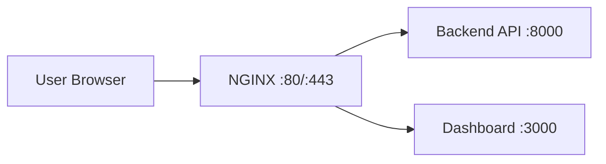

# NGINX Basics for Reverse Proxy

## Apa itu NGINX?

NGINX adalah web server yang sering dipakai sebagai reverse proxy. Dalam deployment AIoT, NGINX biasanya menerima request dari internet lalu meneruskannya ke backend service yang berjalan di port internal.

## Kenapa NGINX penting?

- Menyembunyikan port internal backend.
- Mendukung routing domain/subpath.
- Bisa menangani static file dengan efisien.
- Umum dipakai untuk dasar setup HTTPS.

## Alur sederhana reverse proxy



## Contoh konfigurasi dasar

```nginx
server {
    listen 80;
    server_name iot.example.com;

    location / {
        proxy_pass http://127.0.0.1:3000;
        proxy_set_header Host $host;
        proxy_set_header X-Real-IP $remote_addr;
    }

    location /api/ {
        proxy_pass http://127.0.0.1:8000/;
        proxy_set_header Host $host;
        proxy_set_header X-Real-IP $remote_addr;
    }
}
```

Penjelasan:

- `listen 80;`: NGINX mendengarkan di port 80 untuk HTTP dan port 443 untuk HTTPS.
- `server_name iot.example.com;`: Domain yang dilayani.
- `location /`: Semua request ke root diarahkan ke dashboard di port 3000.
- `location /api/`: Request ke path /api/ diarahkan ke backend API di port 8000.
- `proxy_set_header`: Menyertakan header asli dari client untuk backend.
- `proxy_pass`: Alamat backend yang akan menerima request.

## Command NGINX yang sering dipakai

| Kebutuhan | Command |
| --- | --- |
| Cek versi NGINX | `nginx -v` |
| Test konfigurasi | `sudo nginx -t` |
| Reload konfigurasi | `sudo systemctl reload nginx` |
| Restart NGINX | `sudo systemctl restart nginx` |
| Cek status NGINX | `sudo systemctl status nginx` |

## Lokasi file konfigurasi umum (Linux)

- Konfigurasi utama: `/etc/nginx/nginx.conf`
- Site config (Ubuntu/Debian): `/etc/nginx/sites-available/`
- Symlink aktif: `/etc/nginx/sites-enabled/`

## Tips praktik untuk pemula

- Selalu jalankan `nginx -t` sebelum reload/restart.
- Mulai dari 1 domain dan 1 backend dulu.
- Simpan backup file config sebelum diubah.
- Jika akses gagal, cek log NGINX dan status service.

## Ringkasannya

- NGINX membantu mempublikasikan backend dengan pola reverse proxy.
- Konfigurasi yang rapi memudahkan routing API dan dashboard.
- NGINX menjadi langkah penting sebelum masuk ke setup HTTPS production.
