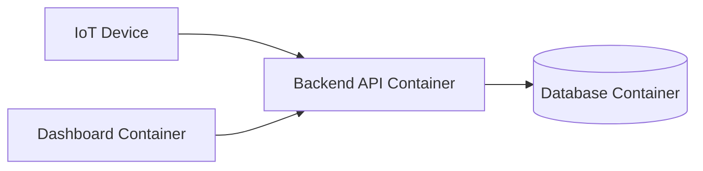

# Deployment Overview

Deployment adalah proses menjalankan aplikasi ke environment target (server lokal, VPS, cloud, atau edge device) agar bisa dipakai user atau perangkat lain.

## Kenapa deployment penting?

Dalam proyek AIoT, deployment membantu sistem bisa dipakai secara nyata, tidak hanya berjalan di laptop pengembang.

Contoh hal yang biasanya dideploy:

- Backend API.
- Database.
- Dashboard web.
- Service pendukung (misalnya broker MQTT atau model AI).

## Cakupan modul Deployment

- Linux basics: fondasi command line dan operasi server.
- SSH basics: cara masuk ke server/VPS dari laptop dengan aman.
- Docker and Container: konsep dan praktik menjalankan service dalam container.
- NGINX basics: reverse proxy untuk mempublikasikan aplikasi.

## Gambaran alur deployment sederhana

1. Build image backend dari Dockerfile.
2. Jalankan container database.
3. Jalankan container backend dan hubungkan ke database.
4. Jalankan container frontend/dashboard.
5. Expose port yang diperlukan untuk akses browser dan device IoT.

Singkatnya, deployment adalah jembatan dari "aplikasi jalan lokal" ke "aplikasi siap dipakai". Untuk memahami deployment, sebaiknya mulai dari dasar-dasarnya dulu dengan urutan sebagai berikut:

- Linux Basics for Deployment
- SSH Basics untuk Deployment
- Docker and Container Basics
- NGINX Basics for Reverse Proxy

Mengapa demikian? Karena server deployment biasanya diakses lewat SSH, container berjalan di atas Linux, dan NGINX biasanya dipakai untuk mempublikasikan aplikasi yang sudah dideploy. Jadi memahami urutannya akan memberikan gambaran yang lebih utuh tentang proses deployment AIoT.

Lanjut ke materi Docker and Container di halaman berikut:

- [Linux Basics for Deployment](linux-basics.md)
- [SSH Basics untuk Deployment](ssh-basics.md)
- [Docker and Container Basics](docker-container.md)
- [NGINX Basics for Reverse Proxy](nginx-basics.md)

Semangat belajar deployment, karena ini adalah langkah penting untuk mewujudkan proyek AIoT yang bisa dipakai secara nyata!

[Kembali ke Home](../index.md)
