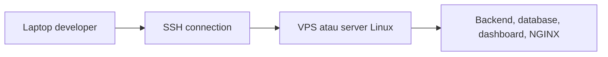

# SSH Basics untuk Deployment

SSH adalah singkatan dari **Secure Shell**.

Dalam deployment, SSH dipakai untuk masuk ke server dari laptop kita lewat terminal. Setelah masuk, kita bisa menjalankan command Linux, mengatur service, menarik kode dari GitHub, menjalankan Docker, atau mengecek log aplikasi.

## Kenapa Perlu SSH?

Saat aplikasi sudah diletakkan di VPS atau server cloud, kita tidak lagi membuka foldernya seperti di laptop.

Biasanya kita masuk ke server dengan pola seperti ini:



SSH adalah pintu masuknya.

## Bentuk Command SSH

Format paling umum:

```bash
ssh username@server_ip
```

Contoh:

```bash
ssh ubuntu@203.0.113.10
```

Artinya:

- `ssh` adalah command untuk membuka koneksi,
- `ubuntu` adalah username di server,
- `203.0.113.10` adalah alamat IP server.

Jika berhasil, terminal kamu akan masuk ke server. Command yang kamu jalankan setelah itu berjalan di server, bukan lagi di laptop.

## Password dan SSH Key

Ada dua cara umum untuk login SSH:

| Cara login | Penjelasan |
| --- | --- |
| Password | masuk dengan password user server |
| SSH key | masuk dengan pasangan private key dan public key |

Untuk belajar awal, password lebih mudah dipahami.

Untuk penggunaan serius, SSH key lebih disarankan karena lebih aman dan tidak perlu mengetik password setiap kali login.

## Membuat SSH Key

Di laptop, kamu bisa membuat key dengan:

```bash
ssh-keygen -t ed25519 -C "nama-atau-email"
```

Biasanya key tersimpan di:

```text
~/.ssh/id_ed25519
~/.ssh/id_ed25519.pub
```

Perbedaan penting:

- `id_ed25519` adalah private key, simpan baik-baik dan jangan dibagikan.
- `id_ed25519.pub` adalah public key, boleh ditempatkan di server.

## Menyalin Public Key ke Server

Jika server mendukung `ssh-copy-id`, kamu bisa menjalankan:

```bash
ssh-copy-id username@server_ip
```

Contoh:

```bash
ssh-copy-id ubuntu@203.0.113.10
```

Setelah itu, coba login:

```bash
ssh ubuntu@203.0.113.10
```

Kalau berhasil tanpa password, SSH key sudah bekerja.

## Menggunakan File Key Tertentu

Kadang key tidak memakai nama default.

Gunakan opsi `-i`:

```bash
ssh -i path/to/private-key username@server_ip
```

Contoh:

```bash
ssh -i ~/.ssh/aiot-server ubuntu@203.0.113.10
```

## Port SSH

Port default SSH adalah `22`.

Jika server memakai port lain, gunakan opsi `-p`:

```bash
ssh -p 2222 ubuntu@203.0.113.10
```

Perhatikan hurufnya:

- `ssh -p` untuk port SSH,
- `scp -P` untuk port saat menyalin file dengan `scp`.

## Menyalin File ke Server

Untuk menyalin file dari laptop ke server, kamu bisa memakai `scp`.

```bash
scp file.txt username@server_ip:/home/username/
```

Contoh:

```bash
scp docker-compose.yml ubuntu@203.0.113.10:/home/ubuntu/app/
```

Untuk folder, tambahkan `-r`:

```bash
scp -r folder-app ubuntu@203.0.113.10:/home/ubuntu/
```

## Command yang Sering Dipakai Setelah Login

Setelah masuk ke server lewat SSH, biasanya kamu akan menjalankan command Linux seperti:

```bash
pwd
ls -la
cd app
git pull
docker ps
docker compose up -d
sudo systemctl status nginx
```

Jika prompt terminal berubah menjadi nama server, itu tanda kamu sedang bekerja di server.

## Error yang Sering Muncul

| Error | Kemungkinan penyebab | Yang bisa dicek |
| --- | --- | --- |
| `Connection timed out` | IP salah, server mati, firewall menutup port | cek IP, status VPS, security group/firewall |
| `Connection refused` | service SSH tidak berjalan atau port salah | cek port SSH dan service `sshd` |
| `Permission denied` | username, password, atau key salah | cek username dan key yang dipakai |
| `WARNING: REMOTE HOST IDENTIFICATION HAS CHANGED` | fingerprint server berubah | pastikan server benar sebelum menghapus known host |

Jangan langsung menghapus warning keamanan tanpa memastikan server yang kamu akses benar.

## Tips Aman

- Jangan bagikan private key.
- Jangan pakai password yang sama untuk banyak server.
- Gunakan user biasa, lalu `sudo` saat butuh akses admin.
- Tutup port yang tidak diperlukan.
- Catat IP, username, port, dan lokasi key yang dipakai tim.

## Quick Check

Sebelum deploy, pastikan kamu tahu:

- IP server,
- username server,
- cara login: password atau SSH key,
- port SSH,
- folder aplikasi di server,
- command untuk mengecek service.

## Menemukan Pola

Saat membaca panduan deployment proyek AIoT, cari bagian yang menyebut:

```text
ssh
scp
VPS
server
systemctl
docker compose
nginx
```

Biasanya deployment dimulai dari login SSH, lalu dilanjutkan dengan setup Linux, Docker, dan NGINX.

[Kembali ke Deployment Overview](overview.md)
