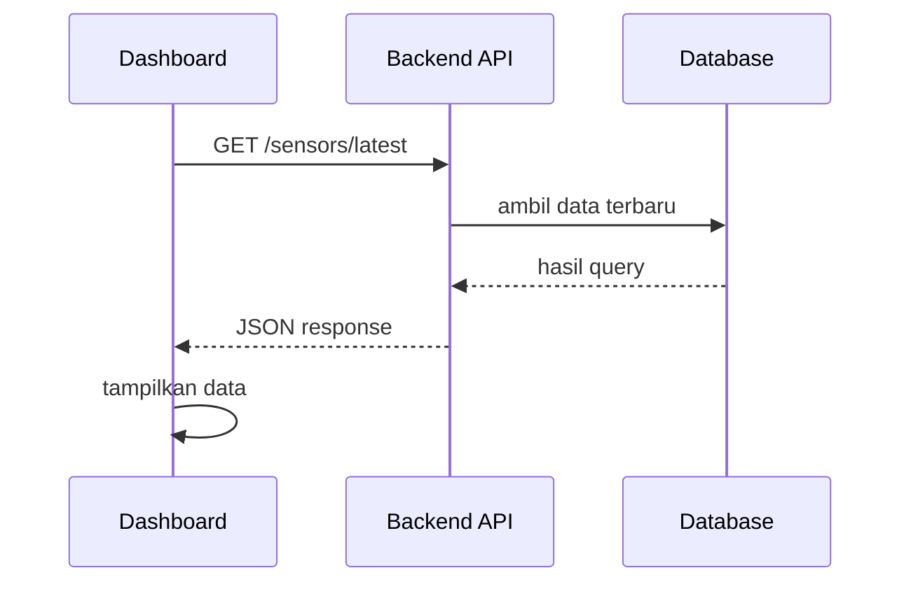

# Integrasi Frontend dengan API

Dashboard tidak hidup sendirian.

Ia perlu mengambil data dari backend. Proses ini disebut integrasi API.

## Alur Dasar



## Hal yang Perlu Disiapkan

Sebelum frontend memanggil API, pastikan:

- backend sedang berjalan,
- endpoint benar,
- response berbentuk JSON,
- CORS sudah diizinkan jika frontend dan backend beda port.

## Fetch Data

Contoh sederhana:

```js
const response = await fetch("http://127.0.0.1:8000/sensors/latest");
const sensors = await response.json();
```

Kode ini mengambil data dari backend, lalu mengubah response menjadi object JavaScript.

## Loading, Error, dan Empty

Integrasi API tidak selalu sukses.

Karena itu UI perlu menyiapkan beberapa kondisi:

```text
mulai request -> loading
request sukses + data ada -> tampilkan data
request sukses + data kosong -> tampilkan empty state
request gagal -> tampilkan error
```

## CORS

CORS adalah aturan keamanan browser.

Kalau frontend berjalan di `localhost:5173` dan backend berjalan di `localhost:8000`, browser menganggap keduanya berbeda asal.

Jika backend belum mengizinkan frontend, browser bisa menolak request.

## Menemukan Pola

Buka file frontend yang mengambil data dari API.

Cari kata berikut:

```text
fetch
axios
api
loading
error
```

Jangan baca semua sekaligus. Ikuti satu alur: tombol diklik, data diminta, data tampil.

[Kembali ke Overview Frontend](overview.md)
