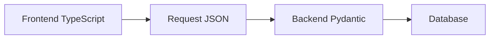

# JavaScript dan TypeScript

JavaScript adalah bahasa pemrograman yang membuat halaman web bisa interaktif.

Kalau Python sering dipakai di backend, JavaScript sering dipakai di browser.

## JavaScript Mirip dengan Python?

Secara rasa, JavaScript dan Python sama-sama bisa dipakai untuk menulis logic sederhana.

Contoh variabel di Python:

```python
name = "device-01"
value = 28.5
is_online = True
```

Contoh variabel di JavaScript:

```js
const name = "device-01";
const value = 28.5;
const isOnline = true;
```

Idenya mirip: kita menyimpan nilai ke dalam nama tertentu.

## Function

Python:

```python
def format_sensor(device_id, value):
    return f"{device_id}: {value}"
```

JavaScript:

```js
function formatSensor(deviceId, value) {
  return `${deviceId}: ${value}`;
}
```

Di frontend, function sering dipakai untuk:

- mengambil data dari API,
- mengubah data sebelum ditampilkan,
- merespons klik tombol,
- menentukan teks status.

## Object

JavaScript sering memakai object untuk menyimpan data berbentuk pasangan key-value.

```js
const sensor = {
  deviceId: "device-01",
  sensorType: "temperature",
  value: 28.5,
};

console.log(sensor.value);
```

Object ini mirip dengan JSON yang dikirim backend.

```json
{
  "deviceId": "device-01",
  "sensorType": "temperature",
  "value": 28.5
}
```

Karena itu JavaScript cocok untuk bekerja dengan data API.

## JavaScript Bersifat Fleksibel

JavaScript mudah dipakai, tetapi fleksibilitasnya bisa membuat error muncul terlambat.

Contoh:

```js
let value = 28.5;
value = "dua puluh delapan";
```

JavaScript mengizinkan perubahan ini. Untuk latihan kecil, ini terasa nyaman.

Namun di proyek yang lebih besar, data yang berubah tipe tanpa sengaja bisa membuat bug sulit dicari.

## TypeScript

TypeScript adalah pengembangan dari JavaScript yang menambahkan aturan tipe data.

Contoh:

```ts
let value: number = 28.5;
value = "dua puluh delapan";
```

Kode di atas akan ditolak oleh TypeScript karena `value` seharusnya angka.

## Kenapa Proyek Memakai TypeScript?

Dalam proyek AIoT, data sering bergerak dari device ke backend, lalu ke frontend.

Kalau bentuk data tidak jelas, error bisa muncul di tempat yang jauh dari penyebabnya.

TypeScript membantu kita mendeteksi kesalahan lebih awal.

Contoh tipe data sensor:

```ts
type SensorReading = {
  deviceId: string;
  sensorType: string;
  value: number;
  unit: string;
};
```

Dengan tipe ini, editor bisa membantu memberi peringatan jika kita salah menulis field atau memasukkan tipe data yang keliru.

## Hubungan TypeScript dengan Validasi

TypeScript membantu saat menulis kode frontend.

Namun TypeScript tidak menggantikan validasi backend. Data dari luar tetap harus dicek oleh backend, misalnya dengan Pydantic.

Pola amannya:



Frontend memakai TypeScript agar developer lebih cepat menemukan kesalahan.

Backend memakai Pydantic agar data dari luar benar-benar divalidasi.

## Menemukan Pola

Buka proyek frontend TypeScript.

Cari file dengan ekstensi:

```text
.ts
.vue
```

Lalu cari kata:

```text
type
interface
const
fetch
axios
```

Pertanyaan kecil:

- data dari API bentuknya seperti apa?
- tipe datanya ditulis di mana?
- apakah nama field frontend sama dengan response backend?

[Kembali ke Overview Frontend](overview.md)
