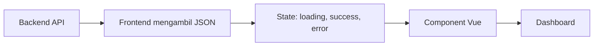

# Frontend Development

Halaman frontend berisi jalur belajar untuk membangun antarmuka dashboard AIoT yang membaca data dari backend dan menampilkan informasi secara real-time.

Frontend adalah bagian yang membuat data terasa bisa dibaca manusia. Dalam AIoT, frontend biasanya menampilkan status device, tabel data sensor, grafik, tombol refresh, dan pesan error.

## Alur Besar

## Urutan Belajar yang Disarankan

1. [Web Basics](web-basics.md)
2. [JavaScript dan TypeScript](javascript-typescript.md)
3. [Vue Basics](vue-basics.md)
4. [Integrasi Frontend dengan API](api-integration.md)
5. [Frontend Fundamental](fundamental.md)
6. [Frontend Mini](../hands-on/frontend-mini.md)

## Capaian Belajar

- Memahami peran HTML, CSS, dan JavaScript.
- Memahami alasan TypeScript dipakai di proyek yang butuh tipe data lebih jelas.
- Memahami component, props, event, dan state di Vue.
- Mengambil data dari API.
- Menampilkan loading, error, dan empty state.
- Membaca struktur folder frontend tanpa tersesat.

[Kembali ke Home](../index.md)
