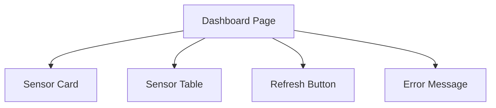

# Vue Basics

Vue membantu kita membangun frontend dari potongan kecil bernama **component**.

Component bisa dianggap seperti bagian dashboard yang punya tugas sendiri: kartu sensor, tabel data, tombol refresh, atau panel status device.

## Kenapa Pakai Component?

Kalau dashboard makin besar, satu file akan sulit dirawat.

Dengan component, kita bisa memecah tampilan menjadi bagian kecil.



## Data Reaktif

Di Vue, data yang berubah bisa otomatis memperbarui tampilan.

Contoh ide sederhananya:

```text
data berubah -> Vue memperbarui UI
```

Karena itu Vue cocok untuk dashboard yang datanya sering berubah.

## Props

Props adalah data yang dikirim dari component induk ke component anak.

Misalnya halaman dashboard punya data sensor, lalu mengirim satu item sensor ke `SensorCard`.

```text
Dashboard -> SensorCard
```

## Event

Event adalah sinyal dari component anak ke component induk.

Contoh:

```text
RefreshButton diklik -> Dashboard mengambil data lagi
```

## Lifecycle

Lifecycle adalah momen ketika component dibuat, muncul di halaman, diperbarui, atau dihapus.

Untuk pemula, cukup ingat satu pola:

> Saat halaman dibuka, ambil data awal dari backend.

## Menemukan Pola

Buka proyek frontend Vue.

Cari:

```text
src/views/
src/components/
```

Lihat satu file di `views/`, lalu cari component apa saja yang dipakai di dalamnya.

Pertanyaan kecil:

- halaman ini menampilkan apa?
- component kecil apa yang dipakai?
- data dari API disimpan di mana?

[Kembali ke Overview Frontend](overview.md)
