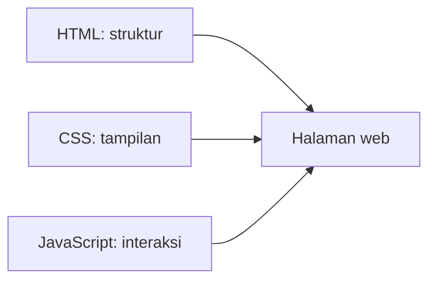

# Web Basics untuk Dashboard

Frontend adalah bagian yang dilihat dan dipakai pengguna.

Dalam proyek AIoT, frontend sering berbentuk dashboard: halaman yang menampilkan status device, data sensor, grafik, tombol kontrol, atau pesan error.

## Tiga Pondasi Web



## HTML

HTML menentukan isi dan struktur halaman.

Contoh:

```html
<h1>Dashboard Sensor</h1>
<p>Status device: online</p>
```

Tanpa HTML, browser tidak tahu teks dan elemen apa yang harus ditampilkan.

## Tag HTML yang Sering Dipakai

Tag HTML memberi tahu browser jenis elemen yang ingin ditampilkan.

| Tag | Fungsi sederhana |
| --- | --- |
| `<html>` | membungkus seluruh dokumen HTML |
| `<head>` | berisi informasi halaman, seperti judul dan link CSS |
| `<body>` | berisi konten yang terlihat di browser |
| `<h1>` sampai `<h6>` | judul dari besar ke kecil |
| `<p>` | paragraf |
| `<a>` | link |
| `` | gambar |
| `<div>` | wadah umum untuk layout |
| `<span>` | wadah kecil di dalam teks |
| `<button>` | tombol |
| `<input>` | input dari pengguna |
| `<form>` | kumpulan input untuk dikirim |
| `<table>` | tabel |
| `<thead>` | bagian kepala tabel |
| `<tbody>` | isi tabel |
| `<tr>` | baris tabel |
| `<th>` | sel judul tabel |
| `<td>` | sel data tabel |

Contoh tabel sensor:

```html
<table>
  <thead>
    <tr>
      <th>Device</th>
      <th>Sensor</th>
      <th>Value</th>
    </tr>
  </thead>
  <tbody>
    <tr>
      <td>device-01</td>
      <td>temperature</td>
      <td>28.5</td>
    </tr>
  </tbody>
</table>
```

Untuk awal, jangan hafalkan semua tag. Cukup kenali tag yang sering muncul di dashboard.

## CSS

CSS menentukan tampilan.

Contoh:

```css
.status {
  color: green;
  font-weight: bold;
}
```

CSS membantu data lebih mudah dibaca. Dashboard yang rapi membuat error lebih cepat terlihat.

## Specificity CSS

Specificity adalah aturan pembobotan CSS.

Kalau ada beberapa style yang menarget elemen yang sama, browser perlu memilih style mana yang menang.

Urutan sederhana dari yang paling lemah ke paling kuat:

| Selector | Contoh | Kekuatan |
| --- | --- | --- |
| tag | `button` | rendah |
| class | `.primary-button` | sedang |
| id | `#save-button` | tinggi |
| inline style | `style="color: red"` | sangat tinggi |

Contoh:

```css
button {
  color: black;
}

.primary-button {
  color: blue;
}

#save-button {
  color: green;
}
```

Jika tombol punya tag `button`, class `primary-button`, dan id `save-button`, warna yang menang adalah hijau karena selector id lebih spesifik.

```html
<button id="save-button" class="primary-button">Save</button>
```

Gunakan class untuk styling sehari-hari. Hindari terlalu sering memakai id atau inline style karena bisa membuat style sulit ditimpa.

## JavaScript

JavaScript membuat halaman bisa bergerak dan bereaksi.

Contoh:

```js
const response = await fetch("http://127.0.0.1:8000/health");
const data = await response.json();
console.log(data);
```

Di dashboard AIoT, JavaScript sering dipakai untuk:

- mengambil data dari backend,
- menampilkan loading,
- menampilkan error,
- memperbarui tabel atau grafik.

Untuk pembahasan lebih lanjut, lanjutkan ke [JavaScript dan TypeScript](javascript-typescript.md).

## State UI

State adalah kondisi halaman pada saat tertentu.

Contoh state sederhana:

| State | Arti |
| --- | --- |
| loading | data sedang diambil |
| success | data berhasil tampil |
| error | data gagal diambil |
| empty | belum ada data |

Dashboard yang baik tidak hanya menampilkan data saat sukses. Ia juga memberi tahu ketika data belum ada atau sedang error.

## Menemukan Pola

Buka dashboard proyek AIoT nyata.

Cari:

- bagian yang menampilkan angka sensor,
- bagian yang menampilkan status,
- bagian yang memanggil API,
- bagian yang muncul saat error.

Kamu tidak harus langsung memahami framework. Cukup kenali dulu: mana struktur, mana tampilan, mana interaksi.

[Kembali ke Overview Frontend](overview.md)
