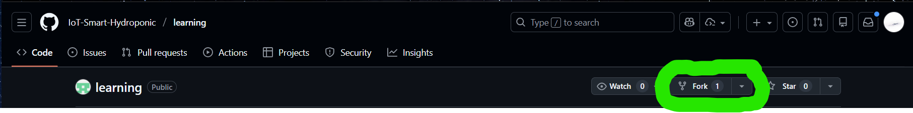

# How to contribute

Untuk berkontribusi pada dokumentasi ini, diharapkan kamu memiliki pemahaman dasar tentang sistem kontrol versi (Git) dan platform GitHub. Berikut adalah langkah-langkah untuk memulai:

1. Fork repository ini ke akun GitHub kamu.

    

2. Clone repository hasil fork ke komputer lokal kamu.

    ```bash
    git clone https://github.com/username/repository.git
    ```

    Opsional (disarankan, sekali saja): set Git agar `pull` selalu memakai rebase.

    ```bash
    git config --global pull.rebase true
    git config --global rebase.autoStash true
    ```

3. Buat branch baru untuk perubahan yang akan kamu lakukan.

    ```bash
    git checkout -b nama-branch-baru
    ```

4. Lakukan perubahan pada file dokumentasi sesuai kebutuhan.

5. Setelah selesai, commit perubahan tersebut dengan pesan yang jelas.

    ```bash
    git add path/file-yang-diubah.md
    git commit -m "docs(scope): deskripsi perubahan"
    ```

    !!! warning "Perhatian"
        Pastikan mengikuti aturan conventional commit untuk menjaga konsistensi riwayat dan menjaga workflow CI/CD tetap berjalan lancar.

6. Push branch baru ke repository fork di GitHub.

    ```bash
    git push origin nama-branch-baru
    ```

7. Buka Pull Request (PR) dari branch baru di repository fork ke repository utama.
8. Saat PR digabungkan, gunakan metode **Rebase and merge** agar riwayat commit tetap linear dan pesan commit tetap terbaca oleh semantic release.
9. Tunggu hingga PR kamu ditinjau dan digabungkan oleh maintainer.
10. Setelah PR digabungkan, kamu bisa menghapus branch lokal dan remote yang sudah tidak diperlukan lagi.

    ```bash
    git branch -d nama-branch-baru
    git push origin --delete nama-branch-baru
    ```

11. Lakukan sinkronisasi repository fork dengan repository utama secara berkala untuk mendapatkan pembaruan terbaru.

    ```bash
    git remote add upstream <URL-repository-utama>
    git fetch upstream
    git checkout main
    git rebase upstream/main
    git push origin main
    ```

12. Jika branch fitur kamu perlu update dari `main`, lakukan rebase sebelum lanjut kerja:

    ```bash
    git checkout nama-branch-baru
    git fetch upstream
    git rebase upstream/main
    ```

    Jika branch fitur sudah pernah di-push dan riwayat berubah setelah rebase, gunakan:

    ```bash
    git push --force-with-lease origin nama-branch-baru
    ```

Ulangi langkah 3 hingga 12 untuk kontribusi selanjutnya.

Selamat! Kamu telah berhasil berkontribusi pada dokumentasi ini. Terima kasih atas partisipasimu! 🎉
