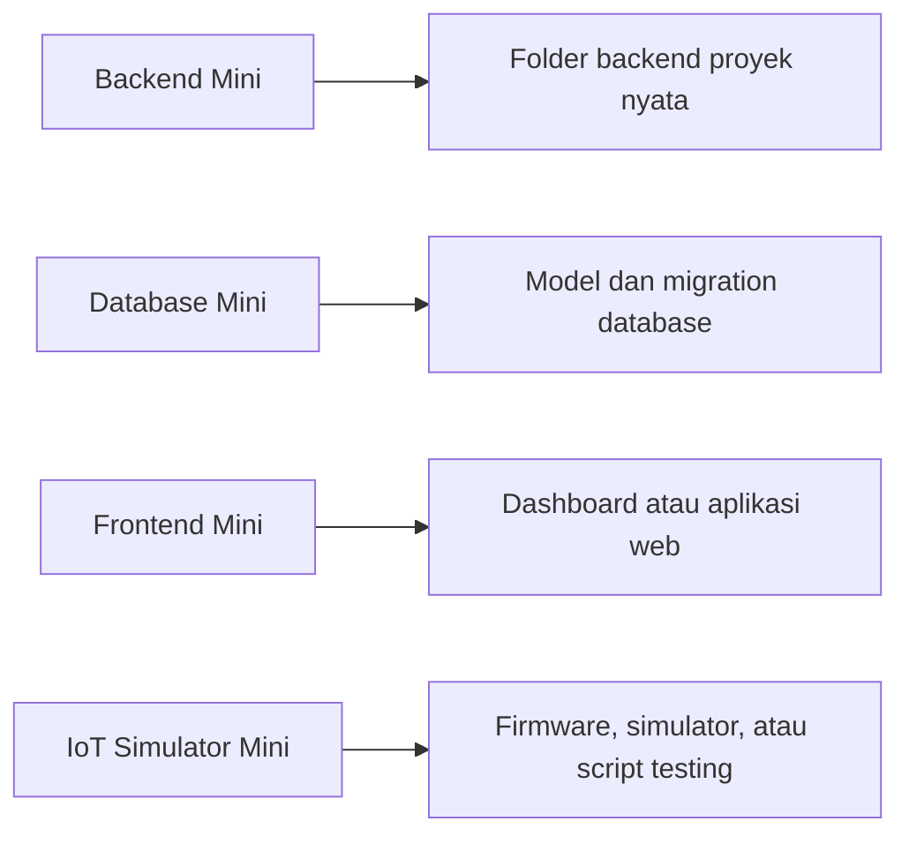

# The Bridge: Dari Mini Project ke Proyek AIoT Nyata

Kamu sudah membuat potongan kecil.

Sekarang waktunya melihat pola yang sama di proyek asli.

Smart Hydroponic dipakai sebagai studi kasus karena repositorinya sudah nyata. Namun pola yang kamu pelajari tetap umum: bisa dipakai untuk smart room, monitoring energi, weather station, sistem parkir, robotika, atau proyek AIoT lain.

## Peta Besar



Tujuannya bukan langsung mengubah semua. Tujuannya mengenali: "Oh, yang besar ini ternyata punya pola yang mirip dengan latihan kecil."

## Perbandingan Pola

| Mini Project | Pola di Proyek AIoT | Contoh di Smart Hydroponic |
| --- | --- |
| `mini_backend/main.py` | tempat aplikasi backend dimulai | `backend/main.py` |
| endpoint `/health` | route untuk menerima request | `backend/routes/` |
| model Pydantic `SensorIn` | schema request dan response | `backend/schemas/` |
| tabel `sensor_readings` | model dan migration database | `backend/models/` dan `backend/migrations/` |
| SQL manual | struktur data yang dikelola aplikasi | migration Alembic |
| `mini_frontend/index.html` | halaman dashboard | `frontend-vue/src/views/` |
| tombol refresh | komponen UI interaktif | `frontend-vue/src/components/` |
| script simulator Python | alat kirim data dummy | folder testing atau simulator |
| data dummy sensor | firmware atau device nyata | folder ESP atau eksperimen perangkat |

## Quick Win

Buka repo studi kasus dan temukan tiga area ini:

```text
backend/routes/
backend/schemas/
frontend-vue/src/views/
```

Kalau kamu bisa menemukan folder itu, kamu sudah punya peta awal.

## Tugas Kecil Pertama

Pilih satu:

- cari endpoint `/health` di backend,
- cari halaman dashboard di frontend,
- cari model data sensor,
- cari script simulasi sensor.

Jangan ubah dulu. Cukup temukan.

## Coba Ubah Sedikit

Setelah menemukan file yang menarik, tulis:

```text
File yang aku temukan:
Menurutku file ini bertugas untuk:
Bagian yang membuatku penasaran:
```

Ini latihan membaca proyek nyata.

## Menemukan Pola

Pertanyaan terakhir:

```text
Kalau aku ingin menambahkan fitur kecil, bagian mana yang paling masuk akal untukku?
```

Jawabanmu boleh sederhana:

- "Aku mau mulai dari frontend."
- "Aku mau mulai dari endpoint backend."
- "Aku mau mulai dari simulator sensor."
- "Aku mau mulai dari database."

Kamu tidak perlu menguasai semuanya. Pilih satu pintu dulu.
