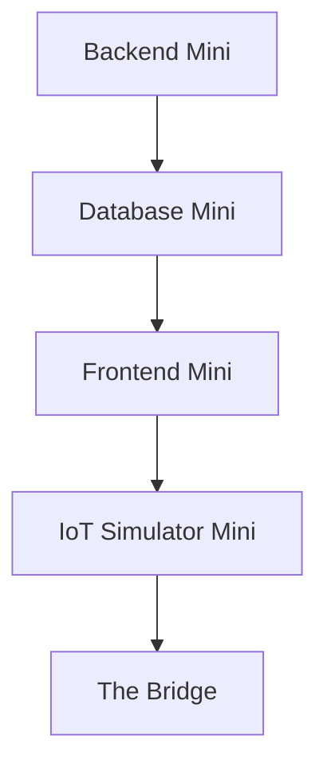

# Pilih Jalur Pertamamu

Kamu tidak perlu langsung paham semua hal.

Di AIoT, ada banyak pintu masuk. Pilih satu dulu. Setelah satu pintu terasa masuk akal, pintu lain akan mulai terlihat nyambung.

## Quick Win

Pilih satu kalimat yang paling terasa menarik:

- "Aku ingin membuat API yang bisa menerima data sensor." -> mulai dari **Backend Mini**.
- "Aku ingin data sensor tersimpan dan bisa dicari lagi." -> mulai dari **Database Mini**.
- "Aku ingin membuat dashboard yang menampilkan data." -> mulai dari **Frontend Mini**.
- "Aku ingin pura-pura jadi perangkat sensor." -> mulai dari **IoT Simulator Mini**.
- "Aku ingin tahu hubungan latihan ini dengan repo asli." -> baca **The Bridge**.

Tidak ada pilihan yang paling benar. Yang penting kamu mulai.

## Jalur Yang Disarankan

Kalau kamu masih bingung, ikuti urutan ini:



Urutan ini membuat kamu melihat alur data pelan-pelan:

```text
data dibuat -> diterima API -> disimpan -> ditampilkan -> dibandingkan dengan proyek asli
```

## Coba Ubah Sedikit

Tulis di catatanmu:

```text
Aku paling penasaran dengan bagian: ...
Alasannya: ...
```

Kalimat ini sederhana, tapi berguna. Nanti saat memilih kontribusi pertama, kamu bisa mulai dari bagian yang memang membuatmu penasaran.

## Menemukan Pola

Setelah memilih jalur, buka salah satu repo AIoT nyata. Jika belum punya contoh lain, gunakan Smart Hydroponic sebagai studi kasus awal.

Lihat folder utama berikut:

- `backend/`
- `frontend-vue/`
- `esp/`
- `docs/`

Coba tebak dulu:

- Folder mana yang cocok untuk orang yang memilih Backend Mini?
- Folder mana yang cocok untuk orang yang memilih Frontend Mini?
- Folder mana yang cocok untuk orang yang memilih IoT Simulator Mini?

Belum perlu benar. Cukup mulai mengenali peta.
