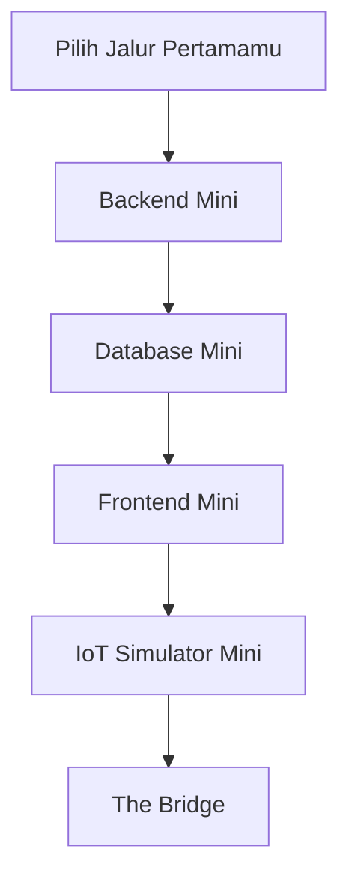

# Hands-on

Bagian ini berisi latihan untuk menerapkan konsep-konsep yang sudah dibahas di bagian sebelumnya. Semua yang tertulis disini hanya sebagian kecil dari yang bisa kamu lakukan. Jadi diharapkan kamu bisa bereksplorasi dan mencoba secara mandiri. Semangat!

## Cara Belajar Di Bagian Ini

Setiap modul punya pola:

1. Buat sesuatu yang kecil.
2. Lihat hasilnya langsung.
3. Ubah sedikit.
4. Temukan pola yang mirip di proyek AIoT nyata.

Bagian terakhir itu bernama **Menemukan Pola**.

Di sana kamu akan diajak membuka repo nyata dan mencari kemiripan. Smart Hydroponic dipakai sebagai salah satu contoh studi kasus yang nantinya bisa membuat kamu untuk menemukan ide sendiri yang lebih menarik lagi.

## Jalur Cepat

Kalau kamu masih bingung mulai dari mana, kamu bisa mengikuti alur belajar ini:

Namun tiap individu memiliki starting point yang berbeda. Jadi tetap tekuni apa yang kamu pilih dan gunakan ilmu-ilmu yang lain sebagai tambahan pengetahuan, serta gunakan untuk mengembangkan apa yang sedang kamu tekuni.

## Modul Mini

- [Pilih Jalur Pertamamu](choose-your-path.md)
- [Backend Mini](backend-mini.md)
- [Database Mini](database-mini.md)
- [Frontend Mini](frontend-mini.md)
- [IoT Simulator Mini](iot-simulator-mini.md)
- [The Bridge](bridge-to-smart-hydroponic.md)

## Prinsipnya

Kalau kamu berhasil melihat endpoint berjalan, data masuk, atau dashboard berubah, sudah menjadi pencapaian yang luar biasa. Jangan terlalu fokus pada hasil akhir, tapi nikmati prosesnya. Kamu akan menemukan banyak hal baru yang bisa kamu pelajari. Tetap penasaran dan jangan takut untuk mencoba hal baru. Semoga sukses dan selamat belajar!
