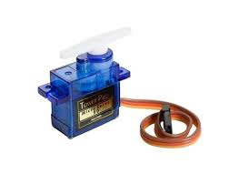
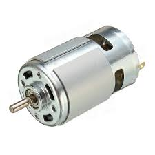
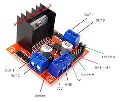

# Aktuator

Aktuator adalah perangkat yang digunakan untuk mengubah sinyal listrik menjadi gerakan fisik atau aksi tertentu. Aktuator biasanya digunakan dalam sistem tertanam (embedded system) untuk mengendalikan perangkat keras, seperti motor, pompa, katup, atau perangkat mekanis lainnya. Aktuator dapat berupa motor servo, motor stepper, solenoid, atau aktuator linier, dan mereka memainkan peran penting dalam berbagai aplikasi IoT, seperti otomasi rumah, robotika, dan sistem kendali industri.

## Buzzer

Buzzer merupakan komponen elektronika atau perangkat output yang berfungsi mengubah getaran listrik menjadi getaran suara, umumnya berupa bunyi bip atau dengung. Terdapat dua jenis buzzer: **Active Buzzer** (langsung berbunyi saat diberi arus DC) dan **Passive Buzzer** (membutuhkan sinyal PWM/frekuensi tertentu untuk menghasilkan nada).

**Spesifikasi (Active Buzzer):**

- **Tegangan Operasi:** 3.3V - 5V DC
- **Arus Maksimal:** < 30mA
- **Frekuensi Resonansi:** ~2500 Hz
- **Tingkat Suara:** > 85 dB

**Fungsi Pin:**

1. **VCC (+):** Dihubungkan ke sumber tegangan (3.3V atau 5V).
2. **GND (-):** Dihubungkan ke Ground.
3. **I/O (Signal):** Pin input digital yang dihubungkan ke mikrokontroler. Jika diberi sinyal HIGH, buzzer akan berbunyi (pada *active high buzzer*).

!!! Note 

    Beberapa tipe buzzer sederhana hanya memiliki 2 pin, yaitu Positif dan Negatif/Ground

---

## Relay Module

Relay adalah komponen sakelar (switch) elektronik yang bekerja berdasarkan prinsip elektromagnetik atau solid-state, yang memungkinkan arus listrik kecil mengendalikan arus yang jauh lebih besar. Alat ini berfungsi sebagai perantara untuk menghubungkan atau memutuskan rangkaian listrik berdaya tinggi (seperti lampu 220V atau pompa air besar) menggunakan sinyal rendah dari mikrokontroler.

**Spesifikasi (Modul Relay 5V 1-Channel):**

- **Tegangan Sinyal Input:** 5V DC (Beberapa mendukung 3.3V)
- **Kapasitas Output (Beban):** 10A 250V AC / 10A 30V DC
- **Isolasi:** Umumnya dilengkapi *Optocoupler* untuk melindungi mikrokontroler dari lonjakan tegangan.

**Fungsi Pin (Sisi Mikrokontroler / Input):**

1. **VCC:** Dihubungkan ke tegangan 5V.
2. **GND:** Dihubungkan ke Ground.
3. **IN:** Pin sinyal dari mikrokontroler (Bekerja secara *Active Low* atau *Active High* tergantung modul).

**Fungsi Terminal (Sisi Beban / Output):**

1. **COM (Common):** Terminal tengah, dihubungkan ke sumber listrik utama beban (misal: kabel positif dari colokan listrik).
2. **NO (Normally Open):** Terminal yang terbuka (mati) saat relay tidak aktif, dan tertutup (hidup) saat relay diberi sinyal.
3. **NC (Normally Closed):** Terminal yang tertutup (hidup) saat relay tidak aktif, dan terbuka (mati) saat relay diberi sinyal.

---

## Pompa DC (Mini Submersible Water Pump)

Pompa DC adalah pompa yang menggunakan daya listrik Arus Searah (Direct Current/DC) sebagai sumber energinya. Varian yang paling sering digunakan adalah pompa celup mini (submersible) yang dapat memindahkan air dari wadah penampungan.

**Spesifikasi (Tipe Mini 3-6V):**

- **Tegangan Operasi:** 3V - 6V DC
- **Arus Operasi:** 130mA - 220mA
- **Laju Aliran (Flow Rate):** 80 hingga 120 Liter/jam
- **Tinggi Angkat Maksimal:** 40 - 110 cm

**Fungsi Kabel:**

1. **Kabel Merah (+):** Kutub positif tegangan DC.
2. **Kabel Hitam (-):** Kutub negatif atau Ground.

!!! warning 

    Pompa DC membutuhkan arus (Ampere) yang lebih besar dari batas maksimal pin GPIO mikrokontroler. **JANGAN PERNAH** menghubungkan kabel pompa secara langsung ke pin digital ESP32/Arduino. Gunakan **Relay** sebagai perantara.

---

## Motor Servo (Micro Servo SG90)

Motor Servo adalah aktuator putar yang memungkinkan kontrol posisi sudut yang sangat presisi. Berbeda dengan motor DC biasa yang berputar terus-menerus, servo umumnya hanya berputar dalam rentang 0 hingga 180 derajat. Komponen ini sangat populer untuk membuat pintu otomatis, robot lengan, atau katup dispenser pakan.

**Spesifikasi (SG90):**

- **Tegangan Operasi:** 4.8V - 6V DC
- **Torsi:** 1.8 kg/cm (pada 4.8V)
- **Kecepatan Putaran:** 0.12 detik / 60 derajat
- **Sudut Putaran:** 0° - 180°

**Fungsi Kabel:**

1. **Coklat / Hitam:** GND (Ground).
2. **Merah:** VCC (Tegangan positif 5V).
3. **Oranye / Kuning:** Pin Sinyal (PWM) yang dihubungkan ke pin mikrokontroler yang mendukung PWM untuk mengatur derajat putaran.

---

## Motor DC & Motor Driver (L298N)

Motor DC adalah aktuator yang mengubah energi listrik menjadi energi mekanik untuk memutar roda. Namun, mikrokontroler tidak bisa mengatur arah putaran (maju/mundur) dan kecepatan motor secara langsung. Oleh karena itu, dibutuhkan **Motor Driver** seperti L298N yang bertindak sebagai "jembatan pengatur".

**Spesifikasi Modul L298N:**

- **Chip Penggerak:** L298N Dual H-Bridge
- **Tegangan Motor (Vm):** 5V - 35V DC
- **Tegangan Logika (Vcc):** 5V
- **Arus Maksimal:** 2A per *channel* (bisa mengendalikan 2 motor DC sekaligus).

**Fungsi Pin Utama:**

1. **OUT1 & OUT2:** Dihubungkan ke kutub positif dan negatif Motor DC pertama (Kiri).
2. **OUT3 & OUT4:** Dihubungkan ke Motor DC kedua (Kanan).
3. **12V / VCC:** Input power utama (dari baterai).
4. **GND:** Ground (Harus digabungkan dengan Ground mikrokontroler).
5. **5V:** Output 5V (Bisa digunakan untuk menyuplai Arduino jika baterai utama 7V-12V).
6. **IN1, IN2, IN3, IN4:** Pin logika kontrol putaran yang dihubungkan ke pin digital mikrokontroler. (IN1 & IN2 untuk Motor 1; IN3 & IN4 untuk Motor 2).
7. **ENA & ENB:** Pin kontrol kecepatan (PWM). Jika jumper dilepas, pin ini bisa disambungkan ke pin PWM mikrokontroler untuk mengatur kecepatan motor.
