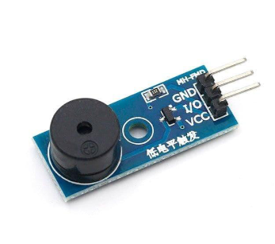
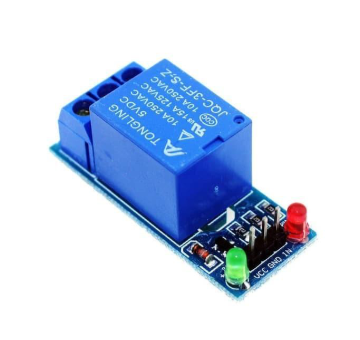
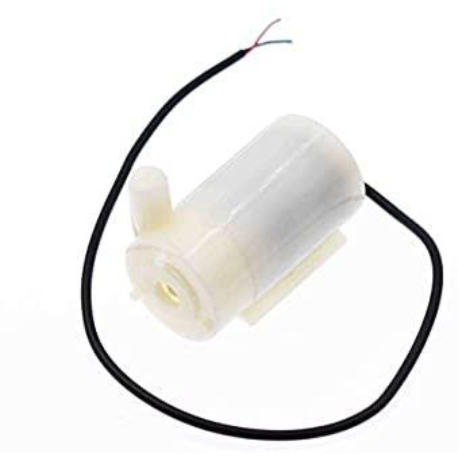

# Aktuator

Aktuator adalah perangkat yang digunakan untuk mengubah sinyal listrik menjadi gerakan fisik atau aksi tertentu. Aktuator biasanya digunakan dalam sistem tertanam (embedded system) untuk mengendalikan perangkat keras, seperti motor, pompa, katup, atau perangkat mekanis lainnya. Aktuator dapat berupa motor servo, motor stepper, solenoid, atau aktuator linier, dan mereka memainkan peran penting dalam berbagai aplikasi IoT, seperti otomasi rumah, robotika, dan sistem kendali industri.

## Buzzer

Buzzer merupakan komponen elektronika atau perangkat output yang berfungsi mengubah getaran listrik menjadi getaran suara, umumnya berupa bunyi bip atau dengung.

## Relay

Relay adalah komponen sakelar (switch) elektronik yang bekerja berdasarkan prinsip elektromagnetik atau solid-state, yang memungkinkan arus listrik kecil mengendalikan arus yang jauh lebih besar. Alat ini berfungsi sebagai perantara untuk menghubungkan atau memutuskan rangkaian Listrik

## Pompa DC

Pompa DC dalah pompa yang menggunakan daya listrik Arus Searah (Direct Current/DC) sebagai sumber energinya.
