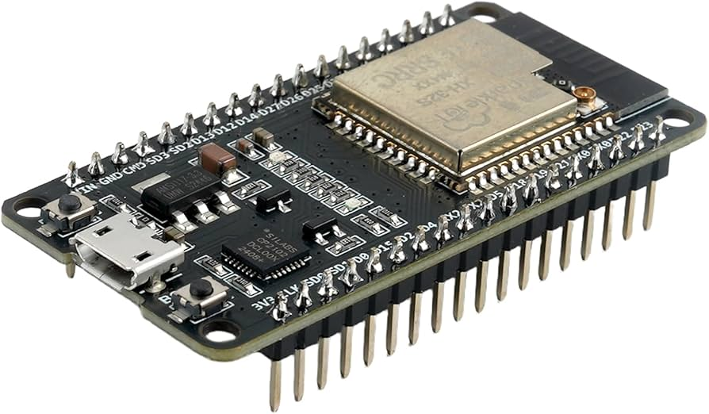
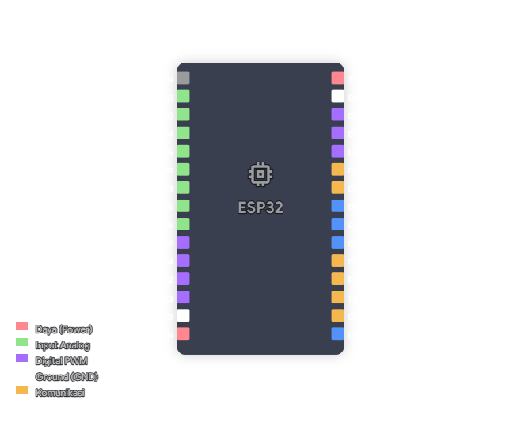
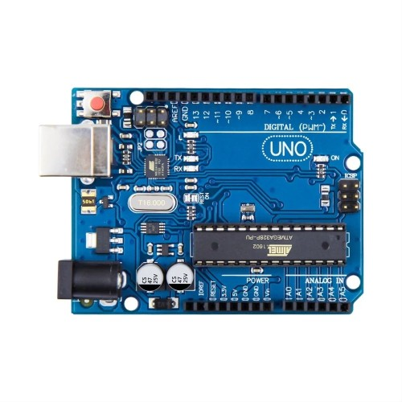
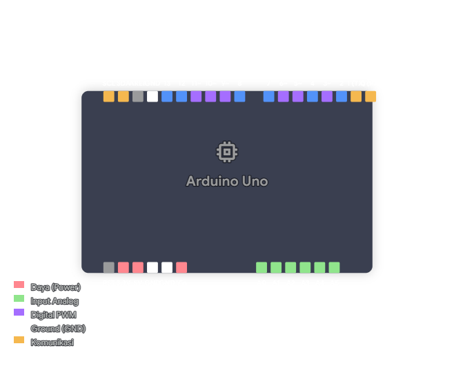

# Microcontrollers

Microcontroller adalah sebuah komputer mini yang terintegrasi dalam satu chip, yang dirancang untuk mengontrol perangkat keras dan menjalankan tugas-tugas tertentu dalam sistem tertanam (embedded system). Microcontroller biasanya terdiri dari CPU, memori (RAM/ROM), dan periferal I/O yang memungkinkan untuk berinteraksi dengan sensor, aktuator, dan perangkat lainnya. Alat ini biasanya digunakan di berbagai aplikasi, seperti smart home, otomotif, smart farming, dan banyak lagi, untuk mengumpulkan data, memproses informasi, dan mengendalikan perangkat secara otomatis.

## ESP32 (DevKit V1)

ESP32 adalah sirkuit terpadu (IC) kompak yang berfungsi sebagai komputer mini pada satu chip, mengintegrasikan CPU, memori (RAM/ROM), dan periferal I/O untuk mengendalikan tugas spesifik pada sistem tertanam (embedded system) yang berbiaya rendah dan hemat energi dengan modul Wi-Fi dan Bluetooth mode ganda yang terintegrasi.

**Spesifikasi:**

- **Mikrokontroler:** Tensilica Xtensa Dual-Core 32-bit LX6.
- **Tegangan Operasi:** 3.3V.
- **Kecepatan Clock:** Hingga 240 MHz.
- **Konektivitas:** Wi-Fi 802.11 b/g/n & Bluetooth v4.2 BR/EDR dan BLE.
- **Memori:** 520 KB SRAM, 4 MB Flash (umumnya).
- **Periferal:** 12-bit ADC (18 channel), 8-bit DAC (2 channel), 10x Capacitive Touch Sensors, 3x UART, 3x SPI, 2x I2C, 16x PWM.

!!! Note

    AI Generated ESP32 pinout diagram!

Referensi: [ESP32 Pinout](https://randomnerdtutorials.com/esp32-pinout-reference-gpios/)

**Fungsi Pin Utama:**

1. **VIN / 5V:** Input tegangan eksternal (disarankan 5V jika melalui regulator internal).
2. **3V3:** Output tegangan 3.3V untuk menyuplai sensor.
3. **GND:** Ground.
4. **EN (Enable):** Tombol Reset.
5. **GPIO (General Purpose Input Output):** Pin digital yang bisa digunakan sebagai input atau output.
6. **ADC (Analog to Digital Converter):** Digunakan untuk membaca sensor analog seperti Soil Moisture, pH, atau TDS (Gunakan GPIO 32-39 untuk ADC1 agar tidak bentrok dengan WiFi).
7. **DAC (Digital to Analog Converter):** Menghasilkan sinyal analog murni (GPIO 25 & 26).
8. **Touch Pins:** Pin sensitif sentuhan (misalnya GPIO 4, 12, 13, 14, 15, 27, 32, 33).
9. **UART (TX/RX):** Komunikasi serial (misalnya untuk modul GPS atau komunikasi antar mikrokontroler).
10. **I2C (SDA/SCL):** Komunikasi untuk layar OLED atau sensor BME280 (Default: SDA=GPIO 21, SCL=GPIO 22).

---

## Arduino Uno R3

Arduino Uno adalah papan mikrokontroler berbasis ATmega328P yang sangat populer untuk pemula maupun profesional. Papan ini memiliki ekosistem yang luas dengan berbagai *shield* tambahan untuk memperluas fungsinya secara instan.

**Spesifikasi:**

- **Mikrokontroler:** ATmega328P (8-bit).
- **Tegangan Operasi:** 5V.
- **Tegangan Input (Vin):** 7V - 12V.
- **Kecepatan Clock:** 16 MHz.
- **Memori:** 32 KB Flash, 2 KB SRAM, 1 KB EEPROM.
- **Digital I/O:** 14 Pin (6 di antaranya mendukung PWM).
- **Analog Input:** 6 Pin (ADC 10-bit).

!!! Note

    AI Generated Arduino Uno pinout diagram!

Referensi: [Arduino Uno Pinout](https://lastminuteengineers.com/arduino-pinout/)

**Fungsi Pin:**

1. **Power Pins:** 5V dan 3.3V sebagai output tegangan untuk komponen eksternal, GND sebagai ground, dan Vin sebagai input tegangan eksternal jika tidak menggunakan USB.
2. **Digital Pins (0-13):** Pin input/output digital. Pin 0 (RX) dan 1 (TX) dipakai untuk komunikasi serial (hindari saat upload kode). Pin bertanda `~` (3, 5, 6, 9, 10, 11) mendukung PWM untuk kontrol kecepatan motor atau intensitas LED.
3. **Analog In (A0-A5):** Pin khusus untuk membaca input analog dari sensor (resolusi 0-1023).
4. **I2C Pins:** SDA berada di pin A4 dan SCL di pin A5 (atau pin khusus SDA/SCL di dekat pin AREF).
5. **SPI Pins:** Pin 10 (SS), 11 (MOSI), 12 (MISO), 13 (SCK).
6. **AREF:** Analog Reference untuk referensi tegangan input analog.
7. **Reset:** Untuk mengulang program dari awal.
