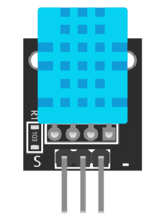
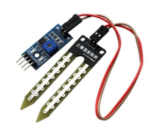

# Sensor IoT

Sensor IoT adalah perangkat yang berguna untuk mengumpulkan data dari lingkungan sekitar dan mengubahnya menjadi sinyal listrik yang dapat diproses oleh sistem IoT. Sensor ini dapat mengukur berbagai parameter seperti suhu, kelembapan, cahaya, tekanan, laju air, dan banyak lagi. Data yang dikumpulkan oleh sensor ini kemudian dapat digunakan untuk analisis, pemantauan, atau pengendalian perangkat lain dalam ekosistem IoT.

## Sensor DHT11

Sensor DHT11 merupakan sensor digital yang digunakan untuk mengukur suhu dan kelembaban udara di sekitarnya.

## Soil Moisture Sensor

Soil moisture (kelembaban tanah) adalah jumlah air yang terkandung dalam pori-pori tanah, yang sangat penting untuk pertumbuhan tanaman, ekologi, dan hidrologi, diukur dengan sensor untuk menentukan kapan waktu menyiram atau memantau kondisi tanah secara akurat
