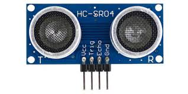
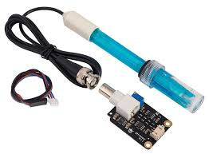
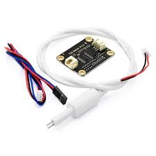
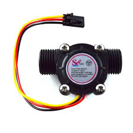

# Sensor IoT

Sensor IoT adalah perangkat yang berguna untuk mengumpulkan data dari lingkungan sekitar dan mengubahnya menjadi sinyal listrik yang dapat diproses oleh sistem IoT. Sensor ini dapat mengukur berbagai parameter seperti suhu, kelembapan, cahaya, tekanan, laju air, dan banyak lagi. Data yang dikumpulkan oleh sensor ini kemudian dapat digunakan untuk analisis, pemantauan, atau pengendalian perangkat lain dalam ekosistem IoT.

## Sensor DHT11

Sensor DHT11 merupakan sensor digital yang digunakan untuk mengukur suhu dan kelembaban udara di sekitarnya.

**Spesifikasi:**

- **Tegangan Operasi:** 3.3V - 5V DC
- **Rentang Pengukuran Suhu:** 0°C hingga 50°C (Akurasi ±2°C)
- **Rentang Pengukuran Kelembaban:** 20% hingga 80% RH (Akurasi ±5% RH)
- **Sinyal Output:** Digital signal

**Fungsi Pin (Umumnya pada Modul 3-Pin):**

1. **VCC:** Dihubungkan ke sumber tegangan (3.3V atau 5V).
2. **DATA / OUT:** Pin output sinyal digital yang dihubungkan ke pin digital mikrokontroler.
3. **GND:** Dihubungkan ke Ground.

*(Catatan: Pada sensor bare/tanpa modul, terdapat 4 pin di mana satu pin tidak terhubung/NC).*

---

## Soil Moisture Sensor

Soil moisture (kelembaban tanah) adalah jumlah air yang terkandung dalam pori-pori tanah, yang sangat penting untuk pertumbuhan tanaman, ekologi, dan hidrologi, diukur dengan sensor untuk menentukan kapan waktu menyiram atau memantau kondisi tanah secara akurat. Umumnya sensor ini dilengkapi dengan modul komparator LM393.

**Spesifikasi:**

- **Tegangan Operasi:** 3.3V - 5V DC
- **Tipe Output:** Analog dan Digital (berdasarkan ambang batas/threshold)
- **Material:** Probe berlapis nikel untuk mencegah korosi ringan.

**Fungsi Pin (Pada Modul LM393):**

1. **VCC:** Dihubungkan ke sumber tegangan (3.3V atau 5V).
2. **GND:** Dihubungkan ke Ground.
3. **D0 (Digital Output):** Mengeluarkan sinyal HIGH/LOW ketika kelembaban tanah mencapai batas ambang yang diatur oleh potensiometer.
4. **A0 (Analog Output):** Mengeluarkan nilai tegangan analog (0-1023) yang merepresentasikan tingkat kelembaban tanah secara *real-time*.

---

## Ultrasonic Sensor (HC-SR04)

Sensor ultrasonik adalah perangkat yang menggunakan gelombang suara frekuensi tinggi untuk mengukur jarak antara sensor dan objek di depannya.

**Spesifikasi:**

- **Tegangan Operasi:** 5V DC
- **Arus Statis:** < 2mA
- **Sudut Pengukuran:** < 15 derajat
- **Rentang Jarak:** 2 cm hingga 400 cm
- **Akurasi:** ±0.3 cm

**Fungsi Pin:**

1. **VCC:** Dihubungkan ke sumber tegangan 5V.
2. **TRIG (Trigger):** Pin input untuk mengirimkan pulsa ultrasonik (diberi sinyal HIGH selama minimal 10 mikrodetik).
3. **ECHO:** Pin output yang akan bernilai HIGH selama gelombang suara memantul kembali, durasinya merepresentasikan jarak pantulan.
4. **GND:** Dihubungkan ke Ground.

---

## Sensor pH Air

Sensor pH digunakan untuk mengukur tingkat keasaman atau kebasaan suatu cairan. Sensor ini sangat berguna dalam sistem hidroponik, akuarium, dan pemantauan kualitas air untuk memastikan cairan berada pada rentang pH yang optimal (0 hingga 14).

**Spesifikasi:**

- **Tegangan Operasi:** 5V DC
- **Rentang Pengukuran:** 0 - 14 pH
- **Akurasi Pengukuran:** ±0.1 pH
- **Waktu Respons:** < 1 menit
- **Suhu Operasi:** 0°C - 60°C

**Fungsi Pin (Pada modul pengkondisi sinyal pH):**

1. **VCC:** Dihubungkan ke sumber tegangan 5V.
2. **GND:** Dihubungkan ke Ground.
3. **Po (Analog Output):** Mengeluarkan tegangan analog yang berbanding lurus dengan nilai pH cairan.
4. **Do (Digital Output):** Pin digital opsional yang aktif berdasarkan limit tegangan/pH (diatur via potensiometer).
5. **To (Temperature Output):** Mengeluarkan sinyal suhu jika sensor dilengkapi dengan termistor.

---

## Sensor TDS (Total Dissolved Solids)

Sensor TDS mengukur jumlah partikel padat yang terlarut dalam air (dinyatakan dalam satuan ppm atau *parts per million*). Sensor ini digunakan untuk mengetahui tingkat kepekatan atau kemurnian air, sering digunakan dalam filtrasi air minum maupun nutrisi hidroponik.

**Spesifikasi:**

- **Tegangan Operasi:** 3.3V - 5.5V DC
- **Rentang Pengukuran:** 0 - 1000 ppm
- **Akurasi Pengukuran:** ±10% F.S. (Full Scale) pada suhu 25°C
- **Konektor Probe:** Tahan air (Waterproof)

**Fungsi Pin:**

1. **VCC (+ / V):** Dihubungkan ke sumber tegangan (3.3V atau 5V).
2. **GND (- / G):** Dihubungkan ke Ground.
3. **A (Analog Output):** Mengeluarkan nilai tegangan analog yang dikonversi mikrokontroler menjadi nilai ppm TDS.

---

## Sensor Water Flow

Sensor Water Flow digunakan untuk menghitung laju aliran dan volume air yang melewati pipa. Sensor ini bekerja menggunakan kincir rotor air dan sensor Hall Effect yang akan mengirimkan sinyal pulsa (PWM) setiap kali rotor berputar akibat dorongan air.

**Spesifikasi (Tipe YF-S201):**

- **Tegangan Operasi:** 5V - 18V DC
- **Kapasitas Aliran (Flow Rate):** 1 hingga 30 Liter/menit
- **Tekanan Air Maksimal:** < 1.75 MPa
- **Karakteristik Pulsa:** Frekuensi (Hz) = 7.5 × Laju Aliran (L/min)

**Fungsi Kabel / Pin:**

1. **Merah (VCC):** Dihubungkan ke sumber tegangan (biasanya 5V untuk mikrokontroler).
2. **Hitam (GND):** Dihubungkan ke Ground.
3. **Kuning (Pulse / Signal):** Pin output sinyal digital yang akan mengirimkan pulsa seiring berputarnya rotor. Pin ini dihubungkan ke pin interrupt pada mikrokontroler.