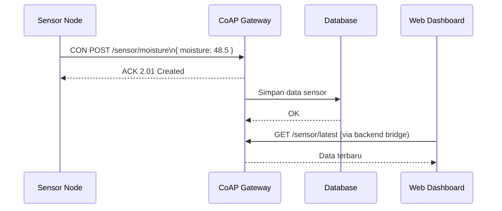

# Belajar CoAP untuk IoT

## Protokol ringan untuk perangkat terbatas

Pada beberapa skenario IoT, perangkat berjalan dengan memori kecil, daya rendah, dan jaringan tidak stabil. CoAP sengaja dirancang untuk kondisi seperti ini.

Contoh alur sederhana:

1. Node sensor membaca nilai kelembapan.
2. Node mengirim data ke server CoAP menggunakan pesan ringan.
3. Server menyimpan data dan memberi respons singkat.
4. Sistem monitoring mengambil data dari backend untuk ditampilkan.

## Apa itu CoAP?

CoAP (Constrained Application Protocol) adalah protokol aplikasi ringan untuk perangkat constrained dan jaringan low-power. CoAP umumnya berjalan di atas UDP.

Dua konsep pentingnya:

- Resource-oriented: mirip konsep URI pada HTTP (`/sensor/temp`).
- Lightweight over UDP: overhead kecil dan efisien untuk IoT.

## Struktur dasar request CoAP

CoAP tetap memakai pola request-response, tetapi format pesannya lebih ringkas.

Komponen utama:

- Method: GET, POST, PUT, DELETE.
- URI-Path: resource tujuan.
- Payload: data yang dikirim (opsional).
- Message Type: CON, NON, ACK, RST.

Contoh resource:

```text
coap://iot-gateway.local/sensor/moisture
```

Contoh payload JSON:

```json
{
  "device_id": "node-01",
  "moisture": 48.5
}
```

## Tipe pesan pada CoAP

| Tipe | Fungsi | Kapan dipakai |
| --- | --- | --- |
| Confirmable (CON) | Pesan yang butuh ACK dari penerima. | Untuk data penting yang perlu konfirmasi penerimaan. |
| Non-confirmable (NON) | Pesan tanpa ACK. | Untuk telemetri periodik yang toleran kehilangan paket. |
| Acknowledgement (ACK) | Balasan untuk pesan CON sebagai tanda pesan diterima. | Saat penerima mengonfirmasi pesan CON. |
| Reset (RST) | Menandakan pesan diterima tapi konteks tidak dikenali. | Saat pesan tidak bisa diproses sesuai konteks sesi/resource. |

## Fitur CoAP yang paling sering dipakai

### Observe

Client dapat subscribe perubahan resource, sehingga server mengirim update saat nilai berubah.

### Block-wise transfer

Membagi payload besar menjadi blok kecil agar tetap efisien pada jaringan terbatas.

### DTLS (opsional keamanan)

CoAP dapat diamankan dengan DTLS saat butuh enkripsi dan autentikasi.

## Siklus request-response CoAP dalam proyek AIoT

1. Device mengirim request CoAP ke resource gateway/server.
2. Server memproses payload sensor.
3. Jika request CON, server membalas ACK.
4. Data diteruskan ke backend/database.
5. Dashboard membaca data dari backend.

### Diagram alur komunikasi CoAP



## Tips praktik

- Gunakan CoAP saat perangkat benar-benar constrained.
- Jaga payload tetap kecil dan sederhana.
- Pertimbangkan DTLS jika data sensitif.
- Jika dashboard berbasis web, gunakan gateway/bridge ke HTTP atau WebSocket.

## Ringkasannya

- CoAP adalah protokol ringan berbasis UDP untuk perangkat IoT terbatas.
- Modelnya mirip HTTP (resource + method) tetapi lebih hemat overhead.
- Sangat cocok untuk jaringan low-power atau lingkungan dengan bandwidth terbatas.