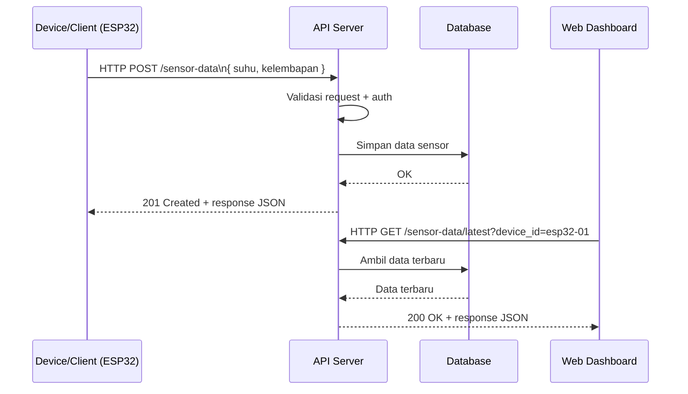

# Belajar HTTP untuk IoT

## Model client dan server

Dalam skenario IoT, biasanya ada dua pihak utama:

- Client: perangkat atau aplikasi yang minta/mengirim data (ESP32, browser, mobile app).
- Server: layanan yang menerima request, proses data, lalu kirim response.

Contoh alur sederhana:

1. ESP32 membaca suhu dan kelembapan.
2. ESP32 kirim data ke server dengan HTTP.
3. Server simpan data ke database.
4. Dashboard ambil data terbaru dari server.

## Apa itu HTTP?

HTTP (Hypertext Transfer Protocol) adalah aturan komunikasi di layer aplikasi untuk pertukaran data antara client dan server.

Dua konsep pentingnya:

- Stateless: tiap request berdiri sendiri. Server tidak otomatis ingat request sebelumnya.
- Request-Response: client kirim request, server balas response.

## Struktur dasar request HTTP

Secara umum, request berisi:

- Method: aksi yang diminta (GET, POST, PUT, DELETE).
- URL/Endpoint: alamat resource di server.
- Header: metadata request (contoh: Content-Type, Authorization).
- Body: data utama, biasanya dipakai di POST/PUT.

Contoh request POST untuk data sensor:

```http
POST /data HTTP/1.1
Content-Type: application/json

{
  "suhu": 26.7,
  "kelembapan": 56.3
}
```

## Tipe data pada request

Saat kirim request ke server, data bisa diletakkan di beberapa tempat. Tiga yang paling sering dipakai adalah query, request param (path param), dan request body.

### Query string

Query dipakai untuk filter, pencarian, sorting, atau pagination. Letaknya di URL setelah tanda `?`.

Contoh:

```text
GET /sensor/history?device_id=esp32-01&limit=10
```

Penjelasan singkat:

- `device_id=esp32-01` untuk pilih data milik device tertentu.
- `limit=10` untuk batasi jumlah data yang diambil.

### Request param (path param)

Request param dipakai saat kita ingin menunjuk resource yang spesifik lewat URL path.

Contoh pola endpoint:

```text
GET /sensor/:id
```

Contoh saat dipanggil:

```text
GET /sensor/123
```

Di sini, nilai `123` adalah path param `id`.

### Request body

Request body dipakai untuk mengirim data utama, biasanya pada method POST atau PUT.

Contoh:

```http
POST /sensor HTTP/1.1
Content-Type: application/json

{
  "device_id": "esp32-01",
  "suhu": 27.1,
  "kelembapan": 60.2
}
```

Body paling umum dipakai dalam format JSON karena mudah dibaca dan mudah diproses di backend.

## Method HTTP yang paling sering dipakai

### GET (Read)

Dipakai untuk mengambil data dari server.

Karakteristik:

- Umumnya tanpa body.
- Parameter sering dikirim lewat query string.
- Bisa di-cache oleh browser.

Contoh:

```text
GET /sensor/latest?id=123
```

### POST (Create)

Dipakai untuk mengirim dan membuat data baru.

Karakteristik:

- Data utama dikirim lewat body.
- Cocok untuk payload yang lebih besar dari query string.

Contoh penggunaan di AIoT:

- ESP32 kirim pembacaan sensor periodik ke endpoint server.

### PUT (Update)

Dipakai untuk memperbarui data yang sudah ada.

Contoh:

- Update konfigurasi ambang batas suhu perangkat.

### DELETE (Delete)

Dipakai untuk menghapus resource tertentu.

Contoh:

- Hapus data sensor duplikat atau data uji.

## Siklus request-response dalam proyek AIoT

1. Client mengirim request ke endpoint API.
2. Server validasi data (format, token, nilai wajib).
3. Server proses logika bisnis.
4. Server kirim response status dan data.

### Diagram alur request-response HTTP



Contoh status code yang sering muncul:

- 200 OK: request berhasil.
- 201 Created: data baru berhasil dibuat.
- 400 Bad Request: format/isi request tidak valid.
- 401 Unauthorized: butuh autentikasi.
- 500 Internal Server Error: ada error di sisi server.

## Tips praktik

- Selalu set Content-Type: application/json untuk payload JSON.
- Validasi nilai sensor sebelum dikirim (hindari data kosong/aneh).
- Cek status code di sisi client sebelum parsing response.
- Simpan endpoint API dalam variabel konfigurasi, jangan hardcode di banyak tempat.

## Ringkasannya

- HTTP adalah fondasi komunikasi data client-server pada sistem AIoT berbasis web.
- GET/POST/PUT/DELETE mewakili pola CRUD yang paling umum.
- Untuk data sensor, POST adalah method yang paling sering dipakai untuk pengiriman data dari device ke server.
- Memahami request, header, body, dan status code akan sangat membantu saat debugging integrasi device dan backend.
