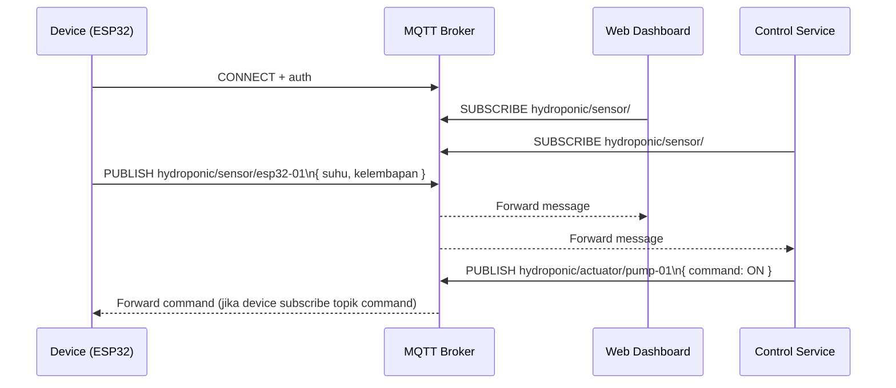

# Belajar MQTT untuk IoT

## Publisher, broker, dan subscriber

Dalam skenario IoT, MQTT memakai pola komunikasi **publish-subscribe**.

- Publisher: perangkat/aplikasi yang mengirim pesan.
- Broker: server perantara yang menerima dan mendistribusikan pesan.
- Subscriber: perangkat/aplikasi yang berlangganan topik tertentu.

Contoh alur sederhana:

1. ESP32 membaca kelembapan media tanam.
2. ESP32 publish data ke broker MQTT.
3. Dashboard subscribe topik sensor dan menerima data real-time.
4. Sistem kontrol subscribe topik yang sama untuk memutuskan nyala/mati pompa.

## Apa itu MQTT?

MQTT (Message Queuing Telemetry Transport) adalah protokol komunikasi ringan di layer aplikasi yang dirancang untuk perangkat dengan resource terbatas dan jaringan yang tidak selalu stabil.

Dua konsep pentingnya:

- Publish-Subscribe: pengirim dan penerima tidak saling terikat langsung.
- Lightweight: payload kecil, overhead rendah, cocok untuk IoT.

## Struktur dasar pesan MQTT

Secara umum, saat publish pesan kita memperhatikan:

- Topic: jalur/logical channel pesan.
- Payload: isi data, biasanya JSON atau string sederhana.
- QoS: tingkat jaminan pengiriman pesan.
- Retain flag: apakah broker menyimpan pesan terakhir pada topik.

Contoh payload JSON yang dipublish:

```json
{
  "device_id": "esp32-01",
  "suhu": 26.7,
  "kelembapan": 56.3,
  "timestamp": "2026-04-17T08:30:00Z"
}
```

Contoh topik:

```text
hydroponic/sensor/esp32-01
```

## Tipe data pada MQTT

MQTT tidak membedakan query, path param, dan body seperti HTTP. Semua data utama dikirim sebagai payload, lalu konteks channel ditentukan lewat topik.

### Topic

Topik adalah alamat pesan. Struktur topik sebaiknya konsisten dan hierarkis.

Contoh pola topik:

```text
hydroponic/<kategori>/<device_id>
```

Contoh implementasi:

```text
hydroponic/sensor/esp32-01
hydroponic/actuator/pump-01
hydroponic/alert/water-level
```

### Payload

Payload adalah isi pesan yang dikirim ke topik. Bisa berupa:

- JSON (paling umum di backend dan dashboard)
- String sederhana (contoh: ON, OFF)
- Angka mentah (contoh: 674)

Contoh payload kontrol aktuator:

```json
{
  "command": "ON",
  "duration_sec": 10
}
```

### Wildcard subscription

Subscriber bisa berlangganan banyak topik sekaligus dengan wildcard:

- `+` untuk satu level topik.
- `#` untuk semua level di bawahnya.

Contoh:

```text
hydroponic/sensor/+      -> semua sensor satu level
hydroponic/sensor/#      -> semua turunan topik sensor
```

## Fitur MQTT yang paling sering dipakai

### QoS (Quality of Service)

Menentukan jaminan pengiriman pesan:

- QoS 0: at most once (cepat, tanpa jaminan sampai).
- QoS 1: at least once (minimal sampai sekali, bisa duplikat).
- QoS 2: exactly once (paling aman, overhead paling tinggi).

### Retained Message

Jika retain aktif, broker menyimpan pesan terakhir pada topik. Subscriber baru akan langsung menerima state terbaru tanpa menunggu publish berikutnya.

### Last Will and Testament (LWT)

Pesan otomatis dari broker saat client terputus mendadak. Umumnya dipakai untuk status online/offline perangkat.

Contoh topik status:

```text
hydroponic/device/esp32-01/status
```

## Siklus publish-subscribe dalam proyek AIoT

1. Device terkoneksi ke broker MQTT.
2. Device publish data sensor ke topik tertentu.
3. Broker meneruskan pesan ke semua subscriber yang cocok.
4. Dashboard menampilkan data terbaru secara real-time.
5. Sistem kontrol dapat publish command ke topik aktuator.

### Diagram alur publish-subscribe MQTT



## Tips praktik

- Gunakan struktur topik yang konsisten sejak awal proyek.
- Simpan kredensial broker di konfigurasi, jangan hardcode.
- Mulai dari QoS 0 atau QoS 1, naik ke QoS 2 hanya saat benar-benar perlu.
- Gunakan retained message untuk state terakhir (misal status pompa).
- Tambahkan LWT agar sistem cepat mendeteksi device offline.

## Ringkasannya

- MQTT cocok untuk komunikasi IoT real-time dan dua arah.
- Pola publish-subscribe membuat publisher dan subscriber tidak saling bergantung langsung.
- Komponen pentingnya adalah broker, topik, payload, dan QoS.
- Untuk AIoT, MQTT sangat efektif untuk streaming data sensor dan kontrol aktuator secara cepat.
