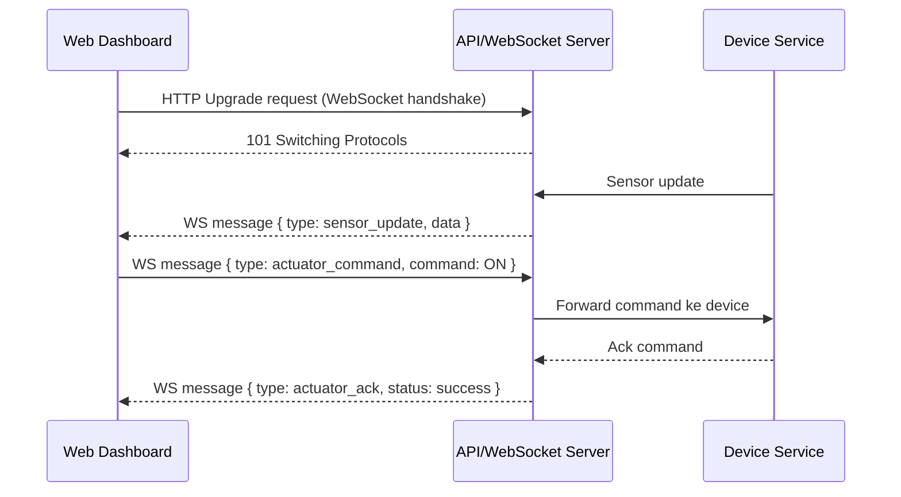

# Belajar WebSocket untuk IoT

## Koneksi persisten dua arah

Dalam skenario IoT, kadang komunikasi perlu berlangsung terus-menerus tanpa membuka koneksi baru berulang kali.

Contoh alur sederhana:

1. Dashboard membuka koneksi WebSocket ke server.
2. Server mengirim data sensor terbaru tanpa diminta ulang.
3. Dashboard menampilkan update real-time (misalnya setiap detik).
4. Dashboard juga bisa kirim command kontrol ke server lewat koneksi yang sama.

## Apa itu WebSocket?

WebSocket adalah protokol komunikasi full-duplex di atas TCP yang memungkinkan client dan server saling kirim data kapan saja setelah koneksi terbentuk.

Dua konsep pentingnya:

- Persistent Connection: koneksi tetap terbuka.
- Full-Duplex: client dan server bisa kirim pesan secara dua arah secara real-time.

## Struktur dasar komunikasi WebSocket

Secara umum, prosesnya terdiri dari:

- Handshake awal melalui HTTP (upgrade ke WebSocket).
- Koneksi persisten setelah handshake berhasil.
- Pertukaran message frame (text atau binary).

Contoh endpoint:

```text
ws://localhost:8000/ws/sensor
wss://iot.example.com/ws/sensor
```

Contoh payload JSON:

```json
{
  "type": "sensor_update",
  "device_id": "esp32-01",
  "suhu": 27.4,
  "kelembapan": 61.2
}
```

## Tipe data pada WebSocket

Berbeda dari HTTP, WebSocket tidak memakai method GET/POST untuk setiap pesan setelah koneksi aktif. Data dikirim sebagai message.

| Tipe | Fungsi |
| --- | --- |
| Text Message | Kirim data dalam format string (biasanya JSON). |
| Binary Message | Kirim data dalam format biner untuk efisiensi. |
| Event Message | Tambahkan field `type` untuk membedakan jenis pesan. Contoh: `sensor_update`, `alert`, `actuator_ack`. |

## Fitur WebSocket yang paling sering dipakai

### Real-time push

Server bisa mengirim data ke client tanpa harus menunggu request baru.

### Low-latency update

Cocok untuk dashboard monitoring, notifikasi, dan kontrol perangkat yang membutuhkan respons cepat.

### Heartbeat / ping-pong

Digunakan untuk mendeteksi koneksi yang putus agar client dapat reconnect otomatis.

## Siklus komunikasi WebSocket dalam proyek AIoT

1. Client melakukan handshake ke endpoint WebSocket.
2. Server menerima koneksi dan melakukan autentikasi.
3. Client subscribe channel/topik logis (sesuai implementasi aplikasi).
4. Server push data sensor ke client secara real-time.
5. Client bisa kirim command kontrol ke server pada koneksi yang sama.

### Diagram alur komunikasi WebSocket



## Tips praktik

- Gunakan `wss://` di production agar trafik terenkripsi.
- Definisikan skema payload event sejak awal agar konsisten.
- Tambahkan mekanisme reconnect otomatis di frontend.
- Batasi frekuensi update jika data sangat tinggi agar dashboard tetap ringan.
- Pisahkan channel untuk data sensor dan command kontrol.

## Ringkasannya

- WebSocket cocok untuk komunikasi real-time dua arah antara dashboard dan server.
- Koneksi persisten membuat update lebih cepat dibanding polling HTTP berulang.
- Sangat berguna untuk monitoring live dan kontrol aktuator dari antarmuka web.
