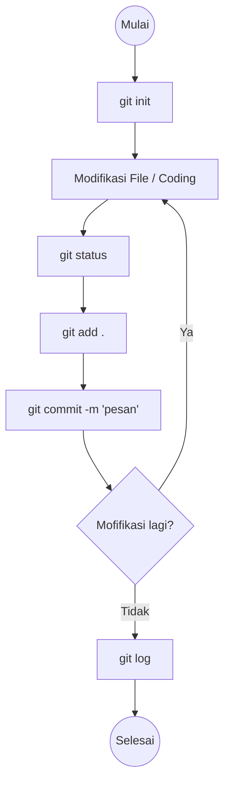
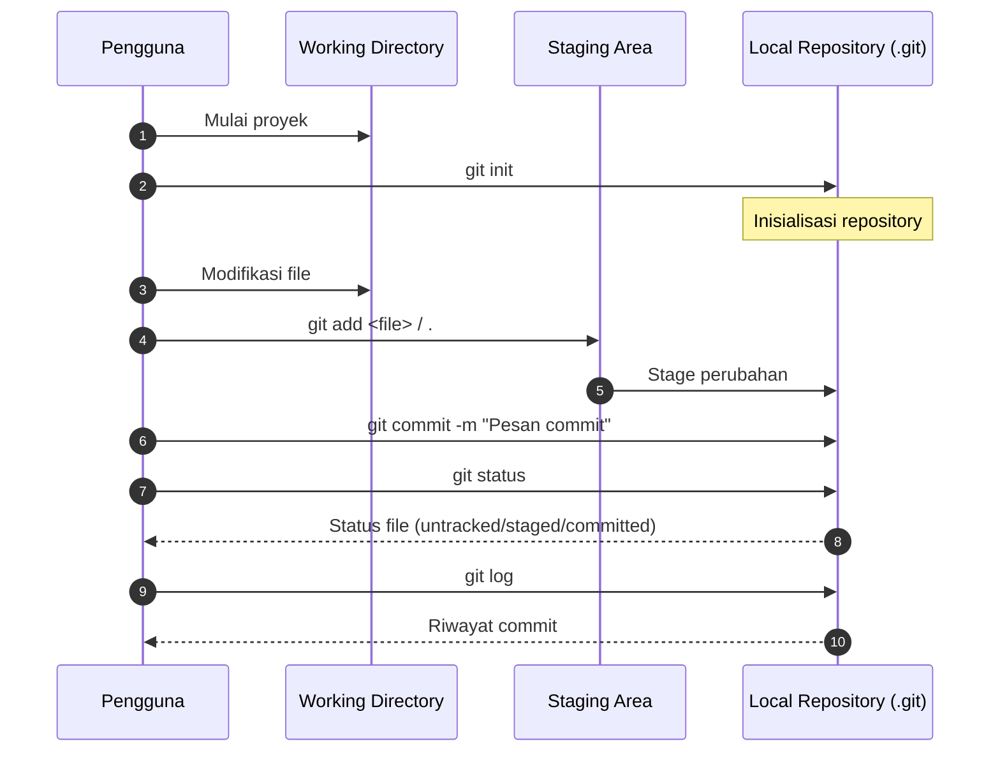

# Basic Git Commands

Pada modul ini, kita akan mempelajari beberapa perintah dasar Git yang sering digunakan dalam pengelolaan versi kode sumber. Tapi sebelum masuk ke perintah-perintah tersebut, pastikan Git sudah terinstal di sistem Anda. Jika belum, silakan merujuk ke modul "Git Installation" [git installation](./git-installation.md).

!!! tip "Git di Powershell (Optional)"
    Agar kamu bisa menggunakan Git di Powershell tanpa harus membuka Git Bash, kamu bisa menambahkan path Git ke dalam variabel lingkungan (environment variables) di Windows. [Lihat panduan ini](https://www.w3schools.com/git/git_install.asp?remote=github#:~:text=How%20to%20Add%20Git%20to%20PATH%20after%20Installation).

## Konfigurasi Awal Git

Pada awal penggunaan Git, kita perlu mengatur nama pengguna dan email yang akan digunakan dalam setiap commit. Gunakan perintah berikut:

1. Mengatur nama pengguna:

    ```bash
    git config --global user.name "Nama kamu"
    ```

2. Mengatur email pengguna:

    ```bash
    git config --global user.email "Email kamu"
    ```

!!! info "Tambahan"
    Terdapat 2 level konfigurasi Git, yaitu `--global` dan `--local`. Opsi `--global` akan mengatur konfigurasi untuk seluruh repository di sistem kamu, sedangkan `--local` hanya akan mengatur konfigurasi untuk repository saat ini saja.

Setelah konfigurasi awal selesai, kita bisa mulai menggunakan beberapa perintah dasar Git berikut:

## Perintah Dasar Git

1. **Inisialisasi Repository Git Baru**

    Untuk membuat repository Git baru di direktori saat ini, gunakan perintah:

    ```bash
    git init
    ```

2. **Menambahkan File ke Staging Area**

    Untuk menambahkan file ke staging area sebelum melakukan commit, gunakan perintah:

    ```bash
    git add <nama_file>
    ```

    Atau untuk menambahkan semua file yang telah diubah:

    ```bash
    git add .
    ```

3. **Melakukan Commit**

    Setelah menambahkan file ke staging area, kamu bisa melakukan commit untuk menyimpan perubahan tersebut ke dalam repository. Gunakan perintah:

    ```bash
    git commit -m "Pesan commit kamu"
    ```

4. **Melihat Status Repository**

    Untuk melihat status repository, termasuk file yang telah diubah dan belum di-commit, gunakan perintah:

    ```bash
    git status
    ```

5. **Melihat Riwayat Commit**

    Untuk melihat riwayat commit pada repository, gunakan perintah:

    ```bash
    git log
    ```

Itu adalah beberapa perintah dasar Git yang sering digunakan. Pada modul selanjutnya, kita akan membahas perintah Git yang lebih lanjut dan konsep-konsep penting lainnya dalam pengelolaan versi kode sumber.

## Alur Penggunaan Git

Secara umum, alur penggunaan Git dapat digambarkan sebagai berikut:



Jika ditambahkan dengan lingkup area kerja Git, alurnya menjadi seperti berikut:




