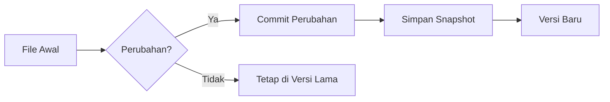
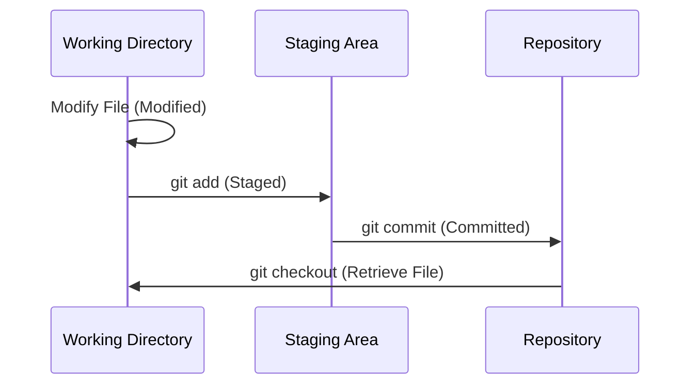

# Pengantar Version Control

## Definisi Version Control System

Version Control merupakan sebuah sistem yang digunakan untuk melacak perubahan pada file atau sekumpulan file dari waktu ke waktu. Dengan menggunakan Version Control System (VCS), kita dapat mengembalikan file atau bahkan keseluruhan proyek ke versi sebelumnya, membandingkan perubahan, dan melihat siapa yang melakukan perubahan tertentu. Fungsi lain dari VCS adalah melakukan pemulihan file jika terjadi kesalahan [^1].

### Cara Kerja Version Control System

Version Control System bekerja dengan menyimpan snapshot dari file atau proyek pada titik waktu tertentu. Setiap kali perubahan dilakukan, VCS mencatat perubahan tersebut sebagai sebuah "commit" yang berisi informasi tentang apa yang diubah, siapa yang mengubahnya, dan kapan perubahan tersebut dilakukan.

## Git

Git merupakah sebuah Tools Version Control System (VCS) yang sangat populer, sifatnya gratis dan open-source sehingga banyak digunakan oleh developer. Git dikembangkan oleh Linus Torvalds dan dirilis pertama kali pada tahun 2005 untuk membantu pengelolaan kode sumber kernel Linux. Tujuan awal dari pembuatan Git adalah para komunitas pengembang Linux membutuhkan sistem kontrol versi yang cepat, simpel, dan dapat diandalkan untuk mengelola perubahan kode sumber yang sangat besar dan kompleks [^2].

### Fitur Utama Git

Beberapa fitur utama dari Git antara lain:

1. **Distributed Version Control**: Setiap pengguna memiliki salinan lengkap dari seluruh repository, memungkinkan mereka untuk bekerja secara offline dan melakukan commit lokal.
2. **Branching dan Merging**: Git memudahkan pembuatan cabang (branch) untuk mengembangkan fitur baru atau memperbaiki bug tanpa mengganggu kode utama. Setelah selesai, cabang tersebut dapat digabungkan (merge) kembali ke cabang utama.
3. **Kecepatan**: Git dirancang untuk menjadi sangat cepat dalam melakukan operasi seperti commit, merge, dan checkout.
4. **Integritas Data**: Setiap perubahan yang dilakukan di Git dilindungi oleh checksum, sehingga memastikan integritas data dan mencegah korupsi.
5. **Dukungan untuk Kolaborasi**: Git memungkinkan banyak pengembang untuk bekerja pada proyek yang sama secara bersamaan, dengan mekanisme untuk mengelola konflik yang mungkin terjadi.

### Lingkungan Kerja Git

Git memiliki 3 state file utama, yaitu: Modified, Staged, dan Committed. State ini menggambarkan status file dalam proses pengelolaan versi menggunakan Git:

- **Modified**: File telah diubah di Working Directory tetapi belum ditandai untuk commit.
- **Staged**: File telah ditandai untuk commit dan berada di Staging Area.
- **Committed**: File telah disimpan secara permanen di Repository.

!!! info "Tambahan"
    Direktori yang telah menggunakan Git biasanya disebut sebagai repository atau repo.

3 state tadi juga merujuk pada 3 lingkungan kerja Git yang jika digambarkan akan seperti berikut:

Oke, sampai sini dulu pengantar tentang Version Control dan Git. Pada bagian selanjutnya, kita akan membahas instalasi dan konfigurasi Git serta perintah-perintah dasar yang sering digunakan dalam Git. Selamat belajar!

[^1]: Chacon, Scott; Straub, Ben (2014). Pro Git (Second ed.). Apress. pp. 1–3. ISBN 978-1-4302-5272-3. [About version control](https://git-scm.com/book/en/v2/Getting-Started-About-Version-Control)

[^2]: Chacon, Scott; Straub, Ben (2014). Pro Git (Second ed.). Apress. pp. 1–3. ISBN 978-1-4302-5272-3. [A Short History of Git](https://git-scm.com/book/ms/v2/Getting-Started-A-Short-History-of-Git)
